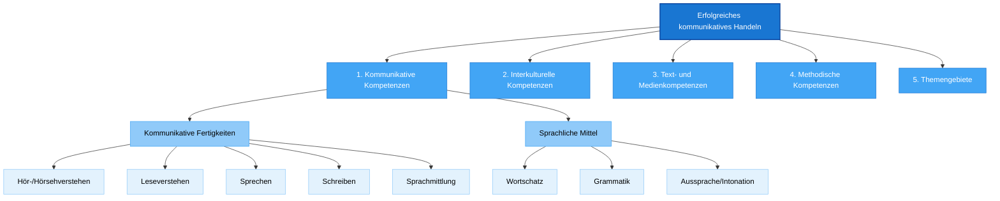

# Kompetenzstrukturmodell Englisch - Detailanalyse

> **Systematische Aufschlüsselung der kommunikativen Kompetenzen im Englischunterricht der Mittelschule**

## Überblick des Kompetenzstrukturmodells

## 1. Kommunikative Kompetenzen

### 1.1 Kommunikative Fertigkeiten

#### Hör- und Hörsehverstehen
- **Jahrgangsstufe 5**: Einfache Äußerungen zu vertrauten Themen verstehen
- **Progression**: Von sorgfältig artikulierten zu natürlich gesprochenen Texten
- **Zielkompetenzen**: Globales und detailliertes Verstehen authentischer Medien

#### Leseverstehen  
- **Ausgangspunkt**: Einfache Arbeitsanweisungen und persönliche Mitteilungen
- **Entwicklung**: Zunehmend komplexe, authentische Texte
- **Strategien**: Erschließung durch Kontext, Vorwissen und Textstruktur

#### Sprechen
- **Dialogisches Sprechen**: Von alltäglichen Begegnungssituationen zu komplexen Diskussionen
- **Monologisches Sprechen**: Von einfachen Präsentationen zu freien Vorträgen
- **Aussprache**: Verständliche Artikulation und angemessene Intonation

#### Schreiben
- **Guided Writing**: Strukturierte Textproduktion mit Scaffolding
- **Creative Writing**: Freie Textgestaltung und kreative Sprachverwendung  
- **Formal Writing**: Bewerbungen, offizielle Korrespondenz, Beschwerden

#### Sprachmittlung (ab Klasse 8)
- **Adressatenbezogene Übertragung**: Deutsche ↔ Englische Sprachrichtung
- **Kompensationsstrategien**: Umschreibung, Nachfragen, Reparaturtechniken
- **Kulturelle Vermittlung**: Erklärung kulturspezifischer Inhalte

### 1.2 Verfügung über sprachliche Mittel

#### Wortschatz
| Jahrgangsstufe | Umfang | Schwerpunkt |
|---|---|---|
| 5 | ca. 550 Wörter | Grundwortschatz aus häufigsten Wörtern |
| 6 | +400 Wörter | Erweiterte Alltagskommunikation |
| 7 | +300 Wörter | Interessens- und themenspezifisch |
| 8 | +300 Wörter | Berufsorientiert und formal |
| 9 | +300 Wörter | Meinungsäußerung und Argumentation |
| 10 | +450 Wörter | Komplexe und abstrakte Themen |

#### Grammatik
**5. Jahrgangsstufe - Grundstrukturen:**
- Simple present/past, Artikel, Pluralbildung
- Personalpronomen, Possessivbegleiter, s-Genitiv
- Einfache Fragen, Verneinung, Kurzantworten

**Progression bis Klasse 10:**
- Present perfect, going-to-future, Passiv
- Relativsätze, if-clauses Typ I-III
- Indirekte Rede, komplexe Satzstrukturen

#### Aussprache und Intonation
- **Phonemsystem**: Internationale Lautschrift als Hilfsmittel
- **Intonationsmuster**: Aussage-, Frage- und Aufforderungssätze
- **Flüssigkeit**: Von einzelnen Wörtern zu zusammenhängenden Äußerungen

## 2. Interkulturelle Kompetenzen

### Orientierungswissen
- **Geographische/politische Gliederung**: UK, USA, Commonwealth
- **Kulturelle Vielfalt**: Verschiedene englischsprachige Länder
- **Alltagskultur**: Familie, Schule, Freizeit, Traditionen

### Bewertung und Reflexion
- **Vergleichen**: Eigene und fremde Kulturen
- **Toleranz**: Aufgeschlossener Umgang mit Unterschieden
- **Kritische Auseinandersetzung**: Stereotype und Vorurteile hinterfragen

### Handeln
- **Situationsangemessenes Verhalten**: Höflichkeitskonventionen
- **Kulturelle Sensibilität**: Missverständnisse vermeiden
- **Mehrsprachige Kompetenz**: Code-switching und kulturelle Vermittlung

## 3. Text- und Medienkompetenzen

### Verstehen und Erschließen
- **Textsortenkenntnis**: Verschiedene Textsorten unterscheiden
- **Erschließungsstrategien**: Kontext, Struktur, Vorwissen nutzen
- **Mediale Gestaltung**: Multimodale Texte verstehen

### Erstellen und Gestalten
- **Textproduktion**: Adressaten- und situationsgerecht
- **Kreative Gestaltung**: Veränderung und Adaption von Texten
- **Mediennutzung**: Digitale Tools für Präsentation und Kommunikation

## 4. Methodische Kompetenzen

### Lernstrategien
- **Wortschatzstrategien**: Strukturierung, Verknüpfung, Wiederholung
- **Grammatikstrategien**: Regelerkennung, Analogiebildung
- **Kommunikationsstrategien**: Paraphrasierung, Nachfragen

### Arbeitstechniken
- **Nachschlagen**: Wörterbuch, Grammatikhilfen
- **Notizen**: Note-taking und Note-making
- **Selbstevaluation**: Lernfortschritt dokumentieren

### Medienkompetenz
- **Recherche**: Informationen suchen und bewerten
- **Präsentation**: Medien zur Visualisierung einsetzen
- **Kommunikation**: Digitale Kommunikationsformen nutzen

## 5. Themengebiete

### Progression der Themengebiete

**Klasse 5-6: Grundlegende Lebensbereiche**
- Familie, Freunde, Wohnen, Schule
- Freizeit, Hobbys, Sport
- Grundlegende Alltagssituationen

**Klasse 7-8: Erweiterte Interessensbereiche**  
- Reisen, Landeskunde
- Berufsorientierung
- Medien und Technologie

**Klasse 9-10: Gesellschaftliche Themen**
- Globalisierung und internationale Beziehungen
- Umwelt und Nachhaltigkeit
- Zukunftsperspektiven und Lebensplanung

## Implementation in der Unterrichtspraxis

### Kompetenzorientierte Unterrichtsplanung
1. **Kompetenzauswahl**: Welche Kompetenzen werden gefördert?
2. **Progression**: Wie bauen die Kompetenzen aufeinander auf?
3. **Integration**: Wie werden verschiedene Kompetenzbereiche verknüpft?
4. **Assessment**: Wie wird Kompetenzentwicklung gemessen?

### Differenzierung nach Kompetenzbereichen
- **Niveaudifferenzierung**: Verschiedene Schwierigkeitsgrade
- **Neigungsdifferenzierung**: Interessensbasierte Themenauswahl
- **Lerntypendifferenzierung**: Verschiedene Zugangswege

### Qualitätssicherung
- **Transparenz**: Kompetenzerwartungen klar kommunizieren
- **Dokumentation**: Kompetenzentwicklung systematisch erfassen
- **Reflexion**: Regelmäßige Überprüfung und Anpassung

---

**Verknüpfte Ressourcen:**
- [[E_Lernziele_Leitfaden|Kompetenzorientierte Lernzielformulierung]]
- [[E_Progression_Jahrgangsstufen|Progression über die Jahrgangsstufen]]
- [[E_Assessment_Kompetenzorientiert|Kompetenzorientierte Leistungsmessung]]

**Meta-Information:**
- **Dokumenttyp**: Fachspezifisches Kompetenzmodell
- **Basis**: LehrplanPLUS Englisch 2025
- **Zielgruppe**: Mittelschule Jahrgangsstufen 5-10
- **Status**: Vollständig implementiert
