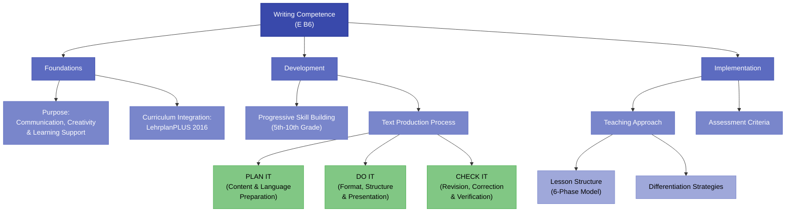

# Writing Competence Framework - E B6 Implementation

> **Systematische Umsetzung der Schreibkompetenz basierend auf Document 3 (E B6) und den Visual Frameworks**

## Core Writing Framework

## 1. Writing Functions & Forms

### 1.1 Functional Categories

#### Exercise Writing (Skill Practice)
- **Abschreiben**: Sicherung und Gedächtnisstütze
- **Niederschreiben**: Konzentration und Abwechslung
- **Notieren/Eintragen**: Strukturierung von Information
- **Formale Schreibspiele**: Beherrschung verschiedener Lerntypen

#### Communicative Writing (Information Sharing)
- **Informationsvermittlung**: Brief, Karte, Notiz
- **Gebrauchstexte**: Anleitungen, Programme
- **Beschreibungen**: Personen, Orte, Prozesse
- **Berichte**: Erlebnisse und Beobachtungen

#### Creative Writing (Expressive Language)
- **Konkrete Poesie**: Visuelle Textgestaltung
- **Fantasiegeschichten**: Imaginative Narrationen
- **Texterweiterung**: Weiterführung vorhandener Texte
- **Sprachspiele**: ABC-Geschichten, Two-word poems

#### Follow-up Writing (Response to Input)
- **Textreflexion**: Antworten auf gelesene/gehörte Texte
- **Medienreaktion**: Auf Filme oder Musik "antworten"
- **Anschlusskommunikation**: Weiterführende Schreibaufgaben

### 1.2 Form Categories by Difficulty

#### EASY Level (Keine eigene Sprachproduktion)
- **Zuordnungsaufgaben**: Absatz-Bild, Satz-Bild, Stichwort-Bild
- **Auswahlaufgaben**: right-wrong, multiple choice
- **Ordnungsaufgaben**: jumbled paragraphs, jumbled sentences
- **Fehlerkorrektur**: Fehlerzahl bekannt/unbekannt

#### MEDIUM Level (Wenig eigene Sprachproduktion)
- **Gap-filling**: Wörter mit/ohne Vorgabe ergänzen
- **Texterweiterung**: Satzruinen ergänzen, wörtliche Rede einflechten
- **Textrekonstruktion**: Vorgeschichte, Schluss, Fortsetzung schreiben
- **Erschließungsraster**: Mit Leitfragen arbeiten

#### CHALLENGING Level (Eigenständige Sprachproduktion)
- **Keyword-based writing**: Wortmaterialliste, word-web, mind-map
- **Textumformung**: Reduktion, Expansion, Perspektivenwechsel
- **Kreative Produktion**: key-word story, "Gegentext" erstellen
- **Freie Gestaltung**: Nach vorgegebener Legende schreiben

## 2. Grade-Level Progression

### 2.1 Detaillierte Kompetenzentwicklung

#### 5. Jahrgangsstufe - Grundlagen
**Kommunikative Fähigkeiten:**
- Einfache Steckbriefe (Name, Alter, Anschrift, Hobbys)
- Knappe Listen (Einkaufsliste für Feier) 
- Einfache persönliche Schreiben (Einladung, Postkarte, Brief)
- Textbausteine aus Vorlagen ergänzen

**Text-/Medienkompetenz:**
- Einfache Texte verändern (Rätsel, einfache Reime)
- Einzelne Elemente ersetzen mit detaillierten Bausteinen
- Freude am kreativen Umgang entwickeln

#### 6. Jahrgangsstufe - Strukturaufbau
**Kommunikative Fähigkeiten:**
- Fragebögen mit Angaben zur Person
- Listen mit wesentlichen Punkten geplanter Vorhaben
- Brief, E-Mail und sehr einfache Geschichten
- Weitgehend orthographisch korrektes Schreiben

**Text-/Medienkompetenz:**
- Einfache Texte inhaltlich und sprachlich verändern
- Elemente ersetzen und ergänzen
- Umfangreiches Angebot an Bausteinen nutzen

#### 7. Jahrgangsstufe - Erweiterung
**Kommunikative Fähigkeiten:**
- Formulare zur Person und Freizeitgestaltung
- Listenhafte Aufzählung wesentlicher Punkte
- Adressatengerechte persönliche Schreiben
- Wörterbuchnutzung bei Unsicherheit

**Text-/Medienkompetenz:**
- Multiple Elemente ersetzen und weitere hinzufügen
- Verkaufsanzeigen ausbauen und erweitern
- Einige mögliche Bausteine selbst auswählen

#### 8. Jahrgangsstufe - Berufsorientierung
**Kommunikative Fähigkeiten:**
- Lebenslauf-Formulare mit berufsbezogenen Angaben
- Kurze Mitteilungen über geplante Vorhaben
- Bewerbungen nach Vorlagen und Vorgaben
- Hinreichend orthographisch korrektes Schreiben

**Text-/Medienkompetenz:**
- Comics und kurze Geschichten ergänzen
- Texte ausschmücken und erweitern
- Ausführlichere Aussagen von Figuren entwickeln

#### 9. Jahrgangsstufe - Argumentation
**Kommunikative Fähigkeiten:**
- Bewerbungsformulare mit berufsbezogenen Angaben
- Note-making zu erlebten/geplanten Ereignissen
- Note-taking für einfache Präsentationen
- Meinung äußern und kurz begründen

**Text-/Medienkompetenz:**
- Geschichten fortführen oder umgestalten
- Handlung abschließen oder Perspektive wechseln
- Einzelne Aspekte aus anderer Sicht darstellen

#### 10. Jahrgangsstufe - Komplexität
**Kommunikative Fähigkeiten:**
- Umfassende Bewerbungsformulare detailliert ausfüllen
- Ausführliche Begründungen formulieren
- Note-making zu abstrakten Themen
- Anfragen und Beschwerden nach Vorgaben

**Text-/Medienkompetenz:**
- Komplexe Texte fortführen und umgestalten
- Textart verändern, alternative Handlungsverläufe
- Erzählperspektive ändern, Handlung verändern

## 3. Text Production Process: PLAN-DO-CHECK

### 3.1 PLAN IT Phase (Planungsphase)

#### Ideensammlung
- **Wortschatz aktivieren**: Relevante Begriffe sammeln
- **Inhaltliche Aspekte**: Nach logischen Kategorien ordnen
- **Strukturierung**: Mind-Maps, Word-Webs, Listen

#### Sprachliche Vorbereitung
- **Redewendungen**: Typische Phrasen für Textsorte
- **Wortfelder**: Thematisch relevante Begriffe
- **Satzstrukturen**: Passende grammatische Muster

#### Formale Planung
- **Textsorte**: Brief, E-Mail, Geschichte, Beschreibung
- **Adressat**: Angemessenheit von Sprache und Inhalt
- **Struktur**: Einleitung, Hauptteil, Schluss

### 3.2 DO IT Phase (Formulierungsphase)

#### Strukturelle Umsetzung
- **Formale Aspekte**: Briefformat, Überschriften, Absätze
- **Logischer Aufbau**: Chronologie, Argumentation, Beschreibung
- **Äußere Form**: Lesbarkeit, Layout, Übersichtlichkeit

#### Sprachliche Realisierung
- **Kohärenz**: Sinnvolle Verknüpfung der Gedanken
- **Kohäsion**: Sprachliche Verbindungen zwischen Sätzen
- **Register**: Angemessene Sprache für Situation

### 3.3 CHECK IT Phase (Überarbeitungsphase)

#### Inhaltliche Kontrolle
- **Vollständigkeit**: Alle wichtigen Punkte abgedeckt?
- **Logik**: Nachvollziehbare Gedankenführung?
- **Adressatenbezug**: Angemessen für Zielgruppe?

#### Sprachliche Korrektur
- **Orthographie**: Wörterbuch bei Unsicherheit nutzen
- **Grammatik**: Strukturen und Zeitformen überprüfen
- **Wortschatz**: Präzise und abwechslungsreiche Begriffe

#### Formale Überprüfung
- **Checkliste**: Systematische Kontrolle aller Aspekte
- **Peer-Review**: Austausch mit Mitschülern
- **Selbstreflexion**: Eigene Schwächen erkennen

## 4. Picture Story Implementation

### 4.1 Auswahlkriterien für Bildergeschichten

#### Motivationsrelevanz
- **Authentizität**: Situationen aus Schülererfahrung
- **Interesse**: Spannende, bewegende Geschichten
- **Identifikation**: Nachvollziehbare Charaktere

#### Didaktische Eignung
- **Sprachliche Angemessenheit**: Dem Niveau entsprechend
- **Visuelle Klarheit**: Eindeutig interpretierbare Bilder
- **Produktionsumfang**: 
  - 5. Jgst.: Einfache Beschreibungen
  - 7. Jgst.: ca. 50 Wörter
  - 8. Jgst.: 50-80 Wörter
  - 9. Jgst.: 80-120 Wörter

### 4.2 Präsentationsmethoden

#### Sequential Presentation
- **Vorteil**: Konzentration auf einzelne Bilder
- **Technik**: Spannung durch schrittweise Enthüllung
- **Einsatz**: Narrative Texte, Problemlösung

#### Simultaneous Presentation
- **Vorteil**: Überblick über Gesamthandlung
- **Technik**: Alle Bilder gleichzeitig zeigen
- **Einsatz**: Beschreibende Texte, Strukturanalyse

#### Unordered Presentation
- **Vorteil**: Aktive Schülerbeteiligung
- **Technik**: Schüler ordnen Bilder selbst
- **Einsatz**: Logisches Denken, Chronologie

#### Incomplete Presentation
- **Vorteil**: Kreative Ergänzung
- **Technik**: Fehlende Bilder durch Text ersetzen
- **Einsatz**: Imaginative Schreibanlässe

### 4.3 Scaffolding-Strategien

#### Beobachtungsrahmen
| Kategorie | Leitfragen | Beispiele |
|-----------|------------|-----------|
| **People** | Who? | Name, age, appearance, clothes |
| **Things** | What? | Objects, animals, vehicles |
| **Places** | Where? | Room, street, building, outdoor |
| **Actions** | What's happening? | Movements, activities, interactions |
| **Time** | When? | Season, day/night, sequence |
| **Feelings** | How? | Emotions, atmosphere, mood |

#### Differentiated Support
- **Schwache Schüler**: Satzfragmente, Lückentexte
- **Mittlere Schüler**: Leitfragen, Strukturvorgaben
- **Starke Schüler**: Freie Gestaltung, Perspektivenwechsel

## 5. Assessment Integration

### 5.1 Formative Assessment

#### During-Writing Assessment
- **Peer Conferences**: Schüler besprechen Entwürfe
- **Teacher Conferences**: Individuelle Beratungsgespräche
- **Self-Assessment**: Reflexion des eigenen Schreibprozesses
- **Process Portfolios**: Sammlung von Entwürfen und Überarbeitungen

#### Feedback Strategies
- **Content-focused**: Erst Inhalt, dann Form
- **Selective**: Wenige, aber wichtige Korrekturen
- **Positive**: Gelungene Aspekte hervorheben
- **Forward-looking**: Ziele für nächste Texte setzen

### 5.2 Summative Assessment

#### Examination Requirements
1. **Korrespondenz**: E-Mails an Gastfamilien, offizielle Anfragen, Bewerbungen, Beschwerden
2. **Kreatives Schreiben**: Bildergeschichten, Keyword-Stories
3. **Text-/Medienkompetenz**: Informationsentnahme, Umgestaltung für verschiedene Formate

#### Rubric Development
- **Content (40%)**: Ideenreichtum, Relevanz, Organisation
- **Language (40%)**: Grammatik, Wortschatz, Orthographie
- **Task Achievement (20%)**: Textsortenangemessenheit, Adressatenbezug

## 6. Lesson Structure Model

### 6.1 Six-Phase Writing Lesson

#### Phase 1: Warm-up
- **Sprachliche Immersion**: Englische Arbeitssprache etablieren
- **Wortschatzaktivierung**: Relevante Begriffe wiederholen
- **Erfolgserlebnisse**: Vertrauen durch bekannte Strukturen

#### Phase 2: Communication Context
- **Schreibanlass**: Authentische Kommunikationssituation
- **Zielklärung**: Warum und für wen wird geschrieben?
- **Erwartungen**: Kriterien transparent machen

#### Phase 3: Develop Support
- **Inhaltliche Hilfen**: Ideensammlung, Strukturierung
- **Sprachliche Hilfen**: Redemittel, Wortfelder, Beispiele
- **Differenzierung**: Verschiedene Unterstützungsniveaus

#### Phase 4: Text Production
- **Individuelle Arbeit**: Schüler schreiben selbständig
- **Prozessbegleitung**: Lehrer als Berater verfügbar
- **Differenzierte Aufgaben**: Verschiedene Schwierigkeitsgrade

#### Phase 5: Evaluation
- **Textbesprechung**: Ergebnisse vorstellen und diskutieren
- **Feedback**: Konstruktive Rückmeldungen geben
- **Reflexion**: Schreibprozess bewerten

#### Phase 6: Reflection
- **Lernfortschritt**: Was wurde gelernt?
- **Transfer**: Wie kann Gelerntes angewendet werden?
- **Zielsetzung**: Nächste Schritte planen

## 7. Digital Integration

### 7.1 Technology-Enhanced Writing

#### Digital Tools
- **Google Docs**: Kollaboratives Schreiben und Kommentieren
- **Padlet**: Ideensammlung und Brainstorming
- **Flipgrid**: Video-Reflexionen zum Schreibprozess
- **Grammarly**: Automatisierte Sprachunterstützung

#### Blended Learning Approaches
- **Online Research**: Informationsbeschaffung für Texte
- **Digital Storytelling**: Multimedia-Texte erstellen
- **Blog Writing**: Authentische Schreibanlässe schaffen
- **E-Portfolios**: Digitale Sammlung von Schreibprodukten

### 7.2 AI-Assisted Writing

#### ChatGPT Integration
- **Brainstorming Partner**: Ideenfindung unterstützen
- **Language Coach**: Sprachliche Alternativen vorschlagen
- **Error Analysis**: Fehler erklären und korrigieren
- **Style Adaptation**: Verschiedene Register üben

#### Ethical Considerations
- **Transparenz**: Offener Umgang mit AI-Nutzung
- **Authentizität**: Eigene Leistung vs. AI-Unterstützung
- **Kompetenzentwicklung**: AI als Lernhilfe, nicht Ersatz
- **Critical Thinking**: Qualität von AI-Output bewerten

---

**Verknüpfte Ressourcen:**
- [[E_Picture_Stories_Sammlung|Bildergeschichten-Sammlung für verschiedene Niveaus]]
- [[E_Writing_Assessment_Rubrics|Bewertungsraster für Schreibaufgaben]]
- [[E_Scaffolding_Templates|Vorlagen für gestufte Hilfen]]
- [[E_Digital_Writing_Tools|Digitale Tools für den Schreibunterricht]]

**Meta-Information:**
- **Dokumenttyp**: Fertigkeitsspezifischer Methodenleitfaden
- **Basis**: Bausteinskrip E B6 + Visual Frameworks
- **Implementierung**: Systematic aufbauend über alle Jahrgangsstufen
- **Status**: Vollständig ausgearbeitet und praxisbereit
