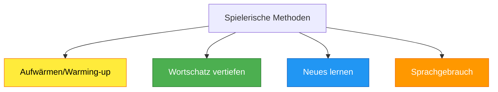

# Spielerische Englisch-Methoden - Systematische Sammlung

> **Umfassende Methodensammlung für motivierenden und aktivierenden Englischunterricht**

## Grundprinzipien des spielerischen Lernens

### Didaktische Begründung
- **Aktivierung**: Alle Schüler werden einbezogen
- **Motivation**: Natürlicher Spieltrieb wird genutzt
- **Kompetenzerwerb**: "Nebenbei" lernen ohne Zwang
- **Soziales Lernen**: Kooperation und fairer Wettbewerb
- **Angstfreie Atmosphäre**: Reduzierte Bewertungsangst

### Einsatzbereiche

## 1. Spiele zum Aufwärmen

### 1.1 Wortschatz-Aktivierung

#### Vokabelbingo
- **Durchführung**: 3x3-Spielfeld, 9 deutsche Übersetzungen eintragen
- **Ablauf**: Lehrer nennt englische Begriffe, Schüler streichen durch
- **Ziel**: "Bingo" bei drei in einer Reihe
- **Varianten**: 
  - Bild-Bingo (Bilder statt Wörter)
  - Definitions-Bingo (Umschreibungen statt Übersetzungen)

#### Vokabelreise
- **Aufstellung**: Zwei Gruppen hintereinander
- **Ablauf**: Lehrer nennt Wort → erste Person übersetzt → geht nach hinten
- **Gewinner**: Gruppe, die zuerst komplett durch ist
- **Differenzierung**: Schwierigere Wörter für stärkere Schüler

#### Flysword
- **Material**: Vokabelkarten an Wand/Tür, zwei Fliegenklatschen
- **Durchführung**: Zwei Schüler gegeneinander, Lehrer nennt Wort
- **Punkte**: Wer zuerst richtig übersetzt und "klatscht"
- **Variante**: Mit Definitionen oder Gegensätzen arbeiten

### 1.2 Bewegungsbasierte Spiele

#### Kids in the Corner
- **Setup**: Ein Schüler pro Raumecke
- **Ablauf**: Lehrer stellt Frage → schnellste richtige Antwort darf eine Ecke weiter
- **Gewinner**: Wer zuerst wieder in seiner Startecke ist
- **Anpassung**: Verschiedene Aufgabentypen je nach Niveau

#### Pass the Ball
- **Durchführung**: Ball zuwerfen + Wort zu Wortfeld nennen
- **Themen**: Christmas, fruits, sports, adjectives, places
- **Regel**: Keine Wiederholungen, flüssiger Rhythmus
- **Erweiterung**: Mit ganzen Sätzen statt Einzelwörtern

### 1.3 Wettkampf-Formate

#### Vokabelkönig
- **Prinzip**: Zwei Schüler stehen sich gegenüber
- **Ablauf**: Lehrer nennt Wort → richtige Antwort bleibt stehen
- **Fortsetzung**: Bis nur noch ein "König" übrig ist
- **Fairness**: Rotation, so dass alle teilnehmen können

#### Wortschatzketten
- **Material**: Satzstreifen mit englisch-deutschen Wortpaaren
- **Start**: Schüler mit "Start"-Karte
- **Ablauf**: Englisches Wort sagen → passende deutsche Übersetzung antwortet
- **Ziel**: Alle Wörter unter einer Minute schaffen

## 2. Spiele zur Wortschatzvertiefung

### 2.1 Klassische Formate

#### Memory
- **Varianten**:
  - Wort-Bild-Paare
  - Englisch-Deutsch-Paare  
  - Synonyme/Antonyme
  - Frage-Antwort-Paare
- **Gruppengröße**: 2-4 Schüler optimal
- **Differenzierung**: Verschiedene Schwierigkeitsstufen

#### Odd One Out
- **Prinzip**: Vier Begriffe, drei gehören zusammen
- **Beispiel**: apple, banana, car, orange (car ist das odd one out)
- **Begründung**: "Car is the odd one out because it's not a fruit"
- **Erweiterung**: Schüler erstellen eigene Rätsel

### 2.2 Strukturierte Wortspiele

#### Stop the Bus
- **Material**: Tabelle mit Kategorien (name, colour, food, animal, school, any word you know)
- **Ablauf**: Buchstabe wird genannt → Kategorien ausfüllen
- **Bewertung**: Punkte für richtige, einzigartige Antworten
- **Anpassung**: Kategorien je nach Unit-Thema

#### Word Snake
- **Prinzip**: Letzter Buchstabe wird zum ersten des nächsten Wortes
- **Beispiel**: cat → table → elephant → telephone
- **Modalitäten**: Mündlich oder schriftlich
- **Thematisch**: Nur Wörter aus bestimmten Wortfeldern

### 2.3 Interaktive Formate

#### Human Pairs/Triplets
- **Konzept**: Schüler bekommen Karten (irregular verbs: take-took-taken)
- **Durchführung**: Zwei "Suchende" gehen vor die Tür
- **Aufgabe**: Passende Gruppen/Paare finden
- **Gewinner**: Wer die meisten korrekten Paare/Triplets sammelt

## 3. Spiele zum Wortschatzlernen

### 3.1 Kooperative Lernspiele

#### Wordscraper
- **Setting**: Partnerarbeit an Treppe
- **Durchführung**: Ein Schüler unten, einer oben
- **Mechanik**: Richtige Antwort = eine Stufe höher
- **Wechsel**: Wenn oberer Schüler erreicht wird
- **Verschärfung**: Falsche Antwort = eine Stufe zurück

#### Walk the Line
- **Aufbau**: Zwei Schüler stehen sich gegenüber
- **Ablauf**: Gegenseitiges Vokabelabfragen
- **Bewegung**: Richtige Antwort = einen Schritt vorwärts
- **Gewinner**: Wer zuerst die Linie erreicht/den anderen berührt

### 3.2 Digitale Integration

#### Online-Tools
- **Hangman**: Digitale Versionen mit Themenwortschätzen
- **LearningApps**: Interaktive Übungen selbst erstellen
- **Quizlet**: Vokabelsets für Klasse anlegen
- **Kahoot**: Live-Quizzes für Wortschatzwiederholung

## 4. Spiele zum Sprachgebrauch

### 4.1 Kommunikative Spiele

#### Find the Question
- **Material**: Antworten vorgeben (z.B. "5 noodles", "2009")
- **Aufgabe**: Passende Fragen formulieren
- **Kreativität**: Mehrere Fragen möglich → Diskussion
- **Sprachanlass**: Authentische Kommunikation

#### Conversation Cards
- **Themen**: What are the names of your pets?
- **Charaktere**: Zorro, Wuscheline, Robin (Fantasienamen für Motivation)
- **Durchführung**: Karten ziehen und Gespräche führen
- **Erweiterung**: Nachfragen stellen, Gespräche vertiefen

### 4.2 Biografische Spiele

#### "When I was a child..."
- **Startphrase**: Vorgegeben
- **Fortsetzung**: Jeder Schüler ergänzt einen Satz
- **Realität vs. Fantasie**: Darf erfunden werden
- **Sprachfokus**: Past tense in natürlichem Kontext

#### "Stand up if you have ever..."
- **Prinzip**: Erfahrungen abfragen durch Aufstehen
- **Beispiele**: "...been to London", "...eaten fish and chips"
- **Soziales Lernen**: Gemeinsamkeiten entdecken
- **Anschlusskommunikation**: Nachfragen zu Erfahrungen

### 4.3 Strukturierte Kommunikation

#### Kettengespräch
- **Ablauf**: A fragt B, B antwortet und fragt C, etc.
- **Themen**: Hobbies, weekend plans, favorite subjects
- **Gedächtnistraining**: Vorherige Antworten wiederholen
- **Differenzierung**: Komplexität der Fragen anpassen

#### Master of Irregular Verbs
- **Wettbewerb**: Irregular verbs in verschiedenen Formen abfragen
- **Steigerung**: Erst einzeln, dann in Sätzen verwenden
- **Belohnung**: "Master"-Status für fehlerfreie Leistung
- **Integration**: In Storytelling und freie Kommunikation

## 5. Technische Implementation

### 5.1 Digitale Spiele

#### Online-Ressourcen
- **www.languageguide.org**: Interaktive Wortschatzübungen
- **www.visuwords.com**: Grafische Wortvernetzungen
- **www.wordwall.net**: Eigene Spiele erstellen
- **www.educandy.com**: Spielvorlagen für Vokabeln
- **www.wordhippo.com**: Synonyme und Wortfamilien
- **www.ideenreise-blog.de**: Kostenlose Spielmaterialien

#### QR-Code Integration
- **Hangman**: Digitale Version mit Klassenwortschatz
- **Opposite-Memory**: Antonyme spielerisch lernen
- **Online Mindmaps**: Kollaborative Wortschatzarbeit
- **Learning-Apps**: Selbsterstellte interaktive Übungen

### 5.2 Analog-Digital-Verknüpfung

#### Blended Learning Approaches
- **Vorbereitung**: Digitale Wortschatzeinführung
- **Durchführung**: Analoge Spiele im Klassenzimmer
- **Nachbereitung**: Online-Vertiefung und Assessment
- **Dokumentation**: Lernfortschritt digital erfassen

## 6. Methodische Progression

### 6.1 Schwierigkeitssteigerung

| Niveau | Spieltyp | Sprachfokus | Beispiele |
|--------|----------|-------------|-----------|
| **Anfänger** | Einzelwörter | Vokabelerkennung | Bingo, Memory |
| **Fortgeschritten** | Wortgruppen | Bedeutungszusammenhänge | Odd one out, Word chains |
| **Selbständig** | Sätze/Texte | Kommunikation | Conversation cards, Storytelling |
| **Kompetent** | Freie Rede | Spontane Sprachverwendung | Debates, Role plays |

### 6.2 Kompetenzorientierte Zuordnung

#### Wortschatz (Vocabulary)
- **Einführung**: Flysword, Picture games
- **Festigung**: Memory, Crosswords
- **Anwendung**: Word associations, Storytelling

#### Sprechen (Speaking)
- **Reproduktion**: Choral speaking, Drilling games
- **Produktion**: Information gap, Role cards
- **Interaktion**: Discussion games, Debates

#### Hören (Listening)
- **Diskrimination**: Sound bingo, Minimal pairs
- **Verstehen**: Audio quizzes, Song activities
- **Reagieren**: TPR games, Follow instructions

#### Lesen (Reading)
- **Dekodierung**: Word puzzles, Reading races
- **Verstehen**: Text adventure games, Reading detectives
- **Bewerten**: Book reviews, Literature circles

#### Schreiben (Writing)
- **Reproduktion**: Copy games, Dictation variants
- **Produktion**: Creative writing prompts, Story chains
- **Überarbeitung**: Peer editing games, Error hunts

## 7. Classroom Management für Spiele

### 7.1 Organisatorische Prinzipien

#### Vor dem Spiel
- **Regeln klar erklären**: Demonstration vor Durchführung
- **Gruppen bilden**: Heterogene Mischung für Fairness
- **Material vorbereiten**: Alles griffbereit haben
- **Zeitrahmen festlegen**: Klare Start- und Endzeiten

#### Während des Spiels
- **Monitoring**: Alle Gruppen im Blick behalten
- **Support**: Hilfestellung ohne Spielfluss zu stören
- **Fairness**: Regelkonformität sicherstellen
- **Motivation**: Positive Verstärkung für alle

#### Nach dem Spiel
- **Reflexion**: Was wurde gelernt?
- **Transfer**: Wie kann das Gelernte verwendet werden?
- **Feedback**: Spielerfahrung besprechen
- **Dokumentation**: Lernfortschritt notieren

### 7.2 Differenzierungsstrategien

#### Leistungsdifferenzierung
- **Aufgabenstellung**: Verschiedene Schwierigkeitsgrade
- **Hilfestellung**: Gestufte Unterstützung
- **Bewertung**: Individuelle Lernfortschritte würdigen
- **Rollen**: Verschiedene Verantwortlichkeiten

#### Interessensdifferenzierung
- **Themenauswahl**: An Schülerinteressen orientiert
- **Spielvarianten**: Multiple Optionen anbieten
- **Eigenverantwortung**: Schüler wählen Schwierigkeitsgrad
- **Kreativität**: Freiraum für eigene Ideen

### 7.3 Bewertung spielerischer Aktivitäten

#### Formative Assessment
- **Beobachtung**: Sprachverwendung während des Spiels
- **Selbsteinschätzung**: Reflexion über Lernzuwachs
- **Peer-Feedback**: Gegenseitige Rückmeldungen
- **Lerntagebuch**: Dokumentation von Spielerfahrungen

#### Summative Assessment
- **Kompetenzdemonstration**: Gelerntes in neuen Kontexten
- **Portfolio**: Sammlung von Spielprodukten
- **Performance**: Präsentation vor der Klasse
- **Transfer**: Anwendung in formellen Tests

---

**Verknüpfte Ressourcen:**
- [[E_Methodenfinder|Methodenfinder für systematische Auswahl]]
- [[E_Classroom_Management|Classroom Management Strategien]]
- [[E_Differenzierung_Best_Practices|Differenzierung im Spielekontext]]
- [[E_Assessment_Formativ|Formative Bewertungsverfahren]]

**Meta-Information:**
- **Dokumenttyp**: Methodensammlung
- **Basis**: SchiLF-Präsentation + fachdidaktische Forschung
- **Zielgruppe**: Englischlehrkräfte aller Erfahrungsstufen
- **Update**: Kontinuierliche Erweiterung geplant
- **Praxiserprobt**: Alle Methoden classroom-tested