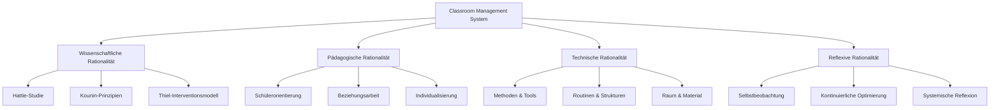

# Master Classroom Management Framework
*Systemtheoretische Integration evidenzbasierter Classroom Management Ansätze*

## Meta-Systematik

### Teilrationalitäten im CM-System

## I. Evidenzbasierte Qualitätskriterien

### 1. Hattie-Framework Integration
**Effektstärke-basierte Prioritäten:**
- [[frameworks/Hattie_Visible_Learning_Integration|Visible Learning - Formatives Assessment]] (d = 0.90)
- [[frameworks/Hattie_Teacher_Effects|Lehrkraft-Effekte]] (d = 0.32-0.48)
- [[frameworks/Hattie_Classroom_Climate|Klassenklima]] (d = 0.48)

### 2. Kounin-Prinzipien Operationalisiert
**Kern-Dimensionen:**
- [[frameworks/Kounin_Withitness_Advanced|Allgegenwärtigkeit - Erweiterte Anwendung]]
- [[frameworks/Kounin_Overlapping_Mastery|Overlapping - Multitasking Mastery]]
- [[frameworks/Kounin_Momentum_Optimization|Momentum - Fluss-Optimierung]]

### 3. Thiel-Interventionsmodell
**5-Stufiges Eskalationsmodell:**
- [[interventionsmodelle/Thiel_5_Stufen_System|Thiel 5-Stufen Interventionssystem]]

## II. Systemtheoretische Integration

### Autopoietische Struktur
Das CM-System reproduziert sich durch:
1. **Beobachtung** → Wahrnehmung von Störungen/Erfolgen
2. **Reflexion** → Systemische Einordnung 
3. **Adaptation** → Strukturelle Anpassung
4. **Implementation** → Neue Praxis
5. **Evaluation** → Rückkopplung

### Strukturelle Kopplungen
- **CM ↔ Fachunterricht:** [[frameworks/CM_Fachspezifische_Integration|Fachspezifische CM-Integration]]
- **CM ↔ Schulentwicklung:** [[frameworks/CM_Schulentwicklung_Interface|CM als Schulentwicklungsmotor]]
- **CM ↔ Elternarbeit:** [[frameworks/CM_Eltern_Kopplung|CM-Eltern Strukturelle Kopplung]]

## III. Qualitätskriterien-Matrix

### Meyer-Helmke-Hattie Synthese
| Dimension | Meyer | Helmke | Hattie | CM-Relevanz |
|-----------|--------|---------|---------|-------------|
| Strukturierung | Klare Strukturierung | Klarheit | Teacher Clarity | [[qualitaetskriterien/Struktur_Klarheit_Matrix|★★★★★]] |
| Lernzeit | Echter Lernzeit | Zeitnutzung | Time on Task | [[qualitaetskriterien/Lernzeit_Optimierung|★★★★☆]] |
| Klima | Lernförderlich | Klima | Classroom Climate | [[qualitaetskriterien/Klima_Systematik|★★★★★]] |
| Aktivierung | - | Aktivierung | Student Voice | [[qualitaetskriterien/Aktivierung_Framework|★★★★☆]] |

## IV. Praktische Integration

### Tägliche CM-Checkliste
**Evidenzbasierte Minimum Standards:**
- [ ] [[qualitaetskriterien/CM_Daily_Checklist|Tägliche CM-Qualitätssicherung]]
- [ ] [[frameworks/Withitness_Daily_Practice|Allgegenwärtigkeit - Tägliche Praxis]]
- [ ] [[interventionsmodelle/Stoerung_Praevention_Daily|Störungsprävention - Tagesroutine]]

### Reflexionszyklen
**Systemische Selbstbeobachtung:**
- **Wöchentlich:** [[reflexion/CM_Weekly_Reflection|CM-Wochenreflexion]]
- **Monatlich:** [[reflexion/CM_Monthly_System_Check|CM-Systemcheck]]
- **Semestral:** [[reflexion/CM_Semester_Evolution|CM-Systementwicklung]]

## V. Erweiterte Frameworks

### Körpersprache als CM-Tool
- [[frameworks/Koerpersprache_CM_Integration|Körpersprache - Systematische CM-Integration]]
- [[frameworks/Nonverbale_Klassenführung|Nonverbale Klassenführung - Advanced]]

### Digitale CM-Tools
- [[frameworks/Digital_CM_Tools|Digitale Classroom Management Tools]]
- [[frameworks/Hybrid_CM_Strategies|Hybrid CM-Strategien]]

## VI. Kontextspezifische Anwendungen

### Fachspezifische CM-Adaptionen
- **GPG/Sozialkunde:** [[frameworks/CM_GPG_Spezifisch|CM für gesellschaftswissenschaftlichen Unterricht]]
- **WiB:** [[frameworks/CM_WiB_Berufsorientierung|CM für Wirtschaft und Beruf]]
- **MINT:** [[frameworks/CM_MINT_Labor|CM für experimentellen Unterricht]]

### Klassenkontext-Adaptionen
- **Heterogene Klassen:** [[frameworks/CM_Heterogenitaet|CM für heterogene Lerngruppen]]
- **Schwierige Klassen:** [[frameworks/CM_Schwierige_Klassen|CM für herausfordernde Gruppen]]
- **Inklusion:** [[frameworks/CM_Inklusion_Systematik|Inklusives Classroom Management]]

---

## Meta-Reflexion: Systemtheoretische Selbstreflexion

### Blinde Flecken des Systems
1. **Kulturelle Kontexte:** Inwieweit sind westliche CM-Modelle universell anwendbar?
2. **Lehrkraft-Persönlichkeit:** Grenzen der Standardisierung von CM-Praktiken
3. **Emergente Eigenschaften:** Unvorhersagbare Klassendynamiken

### Rückkopplungseffekte
- **Positive Rückkopplung:** Erfolgreiches CM verstärkt sich selbst
- **Negative Rückkopplung:** Misslungenes CM kann Spiralen verstärken
- **Strukturelle Drift:** Langsame Veränderung von CM-Praktiken

### Grenzen der Beobachtung
Das System kann sich nicht vollständig selbst beobachten - externe Evaluation notwendig.

---

*Letzte Aktualisierung: {{date}} - Kontinuierliche Systementwicklung*

## Cross-References
- [[_Index_of_Classroom Management|Classroom Management Index]]
- [[../qualitaet/_Qualitaetskriterien_Master|Qualitätskriterien Master]]
- [[../reflexionen/_Reflexions_Framework|Reflexions-Framework]]

#ClassroomManagement #Systemtheorie #Qualitätskriterien #EvidenzbasiertesPraxis #LAA
