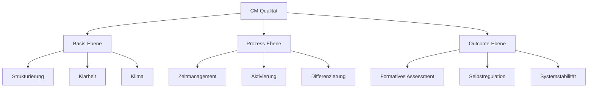

# Qualitätskriterien-Synthese: Meyer-Helmke-Hattie
*Evidenzbasierte Classroom Management Qualitätsmatrix*

## Meta-Systematik
**Systemtheoretische Integration:** Drei wissenschaftliche Rationalitäten zur umfassenden CM-Qualitätsbestimmung

## Überblick der Forschungsansätze

### Methodische Grundlagen
```markdown
**Hilbert Meyer (2004):**
- Basis: Schulpraktische Erfahrung + Empirie
- Focus: Deutsche Schulrealität
- Methode: Merkmalskataloge

**Andreas Helmke (2009):**
- Basis: Empirische Unterrichtsforschung
- Focus: Mess- und evaluierbare Dimensionen
- Methode: Faktorenanalyse

**John Hattie (2009):**
- Basis: Meta-Analyse von 800+ Studien
- Focus: Effektstärken-basierte Evidenz
- Methode: Quantitative Synthese
```

## Zentrale Qualitätsdimensionen im CM-Kontext

### 1. Strukturierung und Klarheit

| Forscher | Dimension | CM-Operationalisierung | Effekt-Level |
|----------|-----------|------------------------|--------------|
| **Meyer** | Klare Strukturierung | Transparente Stundenabläufe, sichtbare Regeln | ★★★★★ |
| **Helmke** | Klarheit der Darstellung | Eindeutige Arbeitsaufträge, strukturierte Tafelbilder | ★★★★★ |
| **Hattie** | Teacher Clarity (d=0.75) | Explizite Lernziele, verständliche Instruktionen | ★★★★★ |

**CM-Integration:**
```markdown
**Strukturelle Klarheit als Störungsprävention:**
- Ritualisierte Stundenabläufe
- Visualisierte Arbeitsschritte
- Transparente Zeitstrukturen
- Eindeutige Regeln und Konsequenzen

**Systemtheoretische Funktion:**
Klarheit reduziert Komplexität → weniger Interpretationsspielraum → weniger Störpotential
```

### 2. Zeitmanagement und Lernzeit-Optimierung

| Forscher | Dimension | CM-Operationalisierung | Effekt-Level |
|----------|-----------|------------------------|--------------|
| **Meyer** | Hoher Anteil echter Lernzeit | Minimierte Organisationszeiten, effiziente Übergänge | ★★★★☆ |
| **Helmke** | Effizienz der Lernzeitnutzung | Zeitverluste vermeiden, Leerlauf reduzieren | ★★★★★ |
| **Hattie** | Time on Task (d=0.38) | Maximierte aktive Lernzeit, minimierte Störungen | ★★★★☆ |

**CM-Integration:**
```markdown
**Zeitökonomische CM-Strategien:**
- Kounin's Momentum: Reibungslose Übergänge
- Overlapping: Multitasking bei Störungen
- Routinierte Abläufe (Material, Sozialformen)
- Präventive Strukturen statt reaktive Interventionen

**Systemtheoretische Funktion:**
Optimierte Zeitnutzung → höhere Aufgabenorientierung → weniger Gelegenheit für Störungen
```

### 3. Lernförderliches Klima

| Forscher | Dimension | CM-Operationalisierung | Effekt-Level |
|----------|-----------|------------------------|--------------|
| **Meyer** | Lernförderliches Klima | Positive Atmosphäre, Wertschätzung, Vertrauen | ★★★★★ |
| **Helmke** | Lernförderlichkeit des Unterrichtsklimas | Angstfreie Umgebung, konstruktive Fehlerkultur | ★★★★★ |
| **Hattie** | Classroom Climate (d=0.48) | Warmes, unterstützendes, aber forderndes Umfeld | ★★★★★ |

**CM-Integration:**
```markdown
**Klimagestaltende CM-Praktiken:**
- Positive Verstärkung als Grundprinzip
- Fehler als Lernchancen rahmen
- Körpersprache der Wertschätzung
- Beziehungsarbeit als CM-Basis

**Systemtheoretische Funktion:**
Positives Klima → intrinsische Kooperation → selbstregulierendes Klassensystem
```

### 4. Individualisierung und Differenzierung

| Forscher | Dimension | CM-Operationalisierung | Effekt-Level |
|----------|-----------|------------------------|--------------|
| **Meyer** | Individuelles Fördern | Adaptive Aufgaben, individuelle Unterstützung | ★★★☆☆ |
| **Helmke** | Individuelle Unterstützung | Passgenaue Hilfen, differenzierte Anforderungen | ★★★★☆ |
| **Hattie** | Individualized Instruction (d=0.23) | Schülerspezifische Anpassungen | ★★★☆☆ |

**CM-Integration:**
```markdown
**Differenziertes CM:**
- Flexible Gruppierungen je nach Sozialverhalten
- Individuelle Verstärker-Systeme
- Adaptive Interventionsstrategien
- Berücksichtigung kultureller Unterschiede

**Systemtheoretische Funktion:**
Individualisierung → bessere System-Umwelt-Passung → weniger Störungen durch Über-/Unterforderung
```

### 5. Aktivierung und Partizipation

| Forscher | Dimension | CM-Operationalisierung | Effekt-Level |
|----------|-----------|------------------------|--------------|
| **Meyer** | Methodenvielfalt | Abwechslungsreiche Arbeitsformen | ★★★☆☆ |
| **Helmke** | Aktivierung | Hohe Schülerbeteiligung, mentale Aktivierung | ★★★★☆ |
| **Hattie** | Student Voice (d=0.55) | Schülerpartizipation, Mitbestimmung | ★★★★☆ |

**CM-Integration:**
```markdown
**Aktivierende CM-Strategien:**
- Kounin's Gruppenaktivierung
- Think-Pair-Share für alle Schüler
- Partizipative Regelentwicklung
- Schüler als Co-Konstrukteure des CM-Systems

**Systemtheoretische Funktion:**
Aktivierung → Verantwortungsübernahme → internalisierte Selbstregulation
```

## Erweiterte Qualitätsdimensionen

### 6. Feedback und Assessment

| Forscher | Dimension | CM-Operationalisierung | Effekt-Level |
|----------|-----------|------------------------|--------------|
| **Meyer** | Transparente Leistungserwartung | Klare Bewertungskriterien | ★★★☆☆ |
| **Helmke** | Sicherung des Lernerfolgs | Kontinuierliche Lernstandskontrollen | ★★★★☆ |
| **Hattie** | Formative Assessment (d=0.90) | Kontinuierliches Feedback zum Lernfortschritt | ★★★★★ |

**CM-Integration:**
```markdown
**Assessment-basiertes CM:**
- Formatives Feedback auch zu Sozialverhalten
- Transparente CM-Erfolgskriterien
- Schüler-Selbsteinschätzung zu Arbeitsverhalten
- Peer-Feedback zu Gruppenprozessen

**Systemtheoretische Funktion:**
Kontinuierliches Feedback → Sichtbares Lernen → Selbststeuerung → reduzierte externe CM-Notwendigkeit
```

### 7. Motivationsförderung

| Forscher | Dimension | CM-Operationalisierung | Effekt-Level |
|----------|-----------|------------------------|--------------|
| **Meyer** | Sinnstiftendes Kommunizieren | Relevanz und Bedeutsamkeit vermitteln | ★★★★☆ |
| **Helmke** | Förderung der Lernmotivation | Interesse wecken, Neugier entwickeln | ★★★★☆ |
| **Hattie** | Student Motivation (d=0.48) | Intrinsische Motivationsförderung | ★★★★☆ |

**CM-Integration:**
```markdown
**Motivationsbasiertes CM:**
- Interessenorientierte Aufgabenstellungen reduzieren Störungen
- Autonomie-Förderung durch Wahlmöglichkeiten
- Kompetenzerleben durch angemessene Herausforderungen
- Soziale Eingebundenheit durch Kooperationsformen

**Systemtheoretische Funktion:**
Intrinsische Motivation → selbstgesteuertes Lernen → emergente Klassenordnung
```

## Integrative CM-Qualitätsmatrix

### Hierarchie der CM-Qualitätskriterien



### Qualitätsstufen im CM

| Stufe | Charakteristika | Indikatoren |
|-------|-----------------|-------------|
| **Exzellent** | Selbstregulierendes System | Schüler übernehmen CM-Verantwortung |
| **Proficient** | Stabile Strukturen | Routinierte Abläufe, seltene Störungen |
| **Entwicklungsfähig** | Grundstrukturen vorhanden | Gelegentliche Störungen, aber Kontrolle |
| **Problematisch** | Instabile Verhältnisse | Häufige Störungen, reaktives Management |

## Systemtheoretische Meta-Reflexion

### Autopoiesis der Qualitätsentwicklung
```markdown
**Selbstverstärkende Qualitätsspiralen:**
Gute CM-Qualität → positive Lernerfahrungen → kooperativere Schüler → 
bessere CM-Bedingungen → weitere Qualitätssteigerung

**Negative Spiralen durchbrechen:**
Schlechte CM-Qualität → Störungen → reaktive Maßnahmen → 
verschlechterte Beziehungen → mehr Störungen
→ INTERVENTION: Systemische Neustrukturierung nötig
```

### Strukturelle Kopplungen
```markdown
**CM ↔ Fachlernen:**
Gutes CM ermöglicht effektives Fachlernen
Erfolgreiches Fachlernen stabilisiert CM-System

**CM ↔ Schulentwicklung:**
Qualitäts-CM trägt zur Schulkultur bei
Schulkultur unterstützt individuelles CM

**CM ↔ Gesellschaft:**
CM als Demokratie-Erziehung
Gesellschaftliche Erwartungen prägen CM-Standards
```

### Blind Spots der Qualitätskriterien
```markdown
**Was die Forschung (noch) nicht erfasst:**
1. Kulturelle Diversität in CM-Ansätzen
2. Digitalisierung als CM-Herausforderung
3. Inklusion als CM-Komplexitätssteigerung
4. Lehrkraft-Belastung durch hohe Qualitätsansprüche
5. Emergente Eigenschaften komplexer Klassensysteme
```

## Praktische Qualitätssicherung

### Evidenzbasierte CM-Evaluation

#### Quantitative Indikatoren:
```markdown
**Störungsfrequenz:**
- Anzahl Interventionen pro Stunde
- Verhältnis positive/negative Verstärkungen
- Lernzeit-Anteil (gemessen)

**Engagement-Indikatoren:**
- Beteiligungsquote
- Aufgaben-Fokuszeit
- Selbstinitiierte Beiträge
```

#### Qualitative Indikatoren:
```markdown
**Klimaindikatoren:**
- Schüler-Feedback zu Atmosphäre
- Beobachtung nonverbaler Signale
- Qualität der Schüler-Schüler-Interaktion

**Systemische Indikatoren:**
- Selbstregulation der Lerngruppe
- Umgang mit Konflikten
- Entwicklung über Zeit
```

### Kontinuierliche Qualitätsentwicklung

#### Reflexionszyklen:
```markdown
**Täglich:** Kurze Selbsteinschätzung zu 3 Kern-Dimensionen
**Wöchentlich:** Systematische Analyse einer Qualitätsdimension
**Monatlich:** Schülerfeedback zu CM-Qualität
**Semestral:** Gesamtsystem-Evaluation mit externem Blick
```

#### Entwicklungsplanung:
```markdown
**SMART-Ziele für CM-Qualität:**
- Spezifisch: Konkrete Qualitätsdimension
- Messbar: Operationalisierte Indikatoren  
- Attraktiv: Persönlich motivierend
- Realistisch: Ressourcen berücksichtigend
- Terminiert: Klare Zeitpläne
```

---

## CM-Qualitäts-Checkliste für den Alltag

### Vor der Stunde:
- [ ] Strukturierung: Ablauf geplant und visualisiert
- [ ] Klarheit: Ziele und Erwartungen definiert
- [ ] Klima: Positive Grundhaltung eingenommen

### Während der Stunde:
- [ ] Zeitmanagement: Übergänge fließend gestaltet
- [ ] Aktivierung: Alle Schüler einbezogen
- [ ] Feedback: Kontinuierliche Rückmeldungen gegeben

### Nach der Stunde:
- [ ] Reflexion: Qualitätsdimensionen selbst bewertet
- [ ] Planung: Optimierungen für Folgestunden abgeleitet
- [ ] Dokumentation: Entwicklungen festgehalten

---

## Cross-References
- [[../frameworks/Hattie_Visible_Learning_Integration|Hattie Visible Learning Integration]]
- [[../frameworks/Meyer_10_Merkmale_CM_Anwendung|Meyer's 10 Merkmale für CM]]
- [[../frameworks/Helmke_Unterrichtsqualitaet_CM|Helmke Unterrichtsqualität für CM]]
- [[../_Master_Classroom_Management_Framework|Master CM Framework]]

#Qualitätskriterien #EvidenzbasiertesPraxis #Meyer #Helmke #Hattie #UnterrichtsQualität #ClassroomManagement #LAA
