# BUV REFLECTION PIPELINE SYSTEM
*Systematische Integration von Reflexionsprozessen zur kontinuierlichen Approximationshoffnung-Steigerung*

## FUNDAMENTALES DESIGNPRINZIP

**Kritische Erkenntnis:** Jede gehaltene Unterrichtseinheit ist ein Reality-Test der generierten Lösungen. BUV-Reflexionen enthalten die wertvollsten Daten zur Steigerung der Approximationshoffnung für alle zukünftigen User-Anfragen.

**Pipeline-Prinzip:** Systematische Extraktion → Automatische Integration → Kontinuierliche Evolution

## AUTO-BUV-INTEGRATION-PIPELINE

### 🔄 REFLEXIONS-ERFASSUNG (automatisch getriggert)
```javascript
function detectBUVReflection(userInput) {
    // BUV-Indikatoren automatisch erkennen
    const buvTriggers = [
        "Stunde war", "hat funktioniert", "Schüler haben",
        "war zu", "ging nicht", "Feedback", "Mentor sagte",
        "lief gut", "Problem war", "nächstes Mal"
    ];
    
    if (containsAny(userInput, buvTriggers)) {
        return {
            type: "BUV_REFLECTION",
            content: userInput,
            priority: "HIGH_LEARNING_VALUE",
            autoProcess: true
        };
    }
}
```

### 📊 LEARNING-EXTRAKTION (systematisch)
```javascript
function extractBUVLearnings(buvReflection) {
    const learning = {
        // Was funktionierte NICHT (höchste Priorität)
        failures: extractFailurePatterns(buvReflection),
        
        // Was funktionierte GUT (Success-Patterns)
        successes: extractSuccessPatterns(buvReflection),
        
        // SuS-Reaktionen (Reality-Feedback)
        studentResponse: extractStudentReactions(buvReflection),
        
        // Zeit/Material-Realität (Approximation-Data)
        practicalReality: extractPracticalConstraints(buvReflection),
        
        // Unerwartete Probleme (Edge-Cases)
        surprises: extractUnexpectedIssues(buvReflection)
    };
    
    return categorizeByImpact(learning);
}
```

### 🎯 AUTO-STANDARD-UPDATE (ohne User-Belastung)
```javascript
function integrateLearningIntoStandards(learnings) {
    for (learning of learnings) {
        switch(learning.category) {
            case "MATERIAL_OVERLOAD":
                updateQualityGate("material_complexity", learning.threshold);
                break;
                
            case "TIMING_UNREALISTIC": 
                updateTemplates("timing_estimates", learning.realityData);
                break;
                
            case "TECH_TOOL_CONFUSION":
                updateTechStrategy("avoid_tools", learning.problematicTools);
                break;
                
            case "SUS_ACTIVATION_FAILED":
                updateActivationStrategies("early_engagement", learning.workingMethods);
                break;
                
            case "HETEROGENEITY_GAP":
                updateDifferentiation("daz_lrs_support", learning.effectiveMethods);
                break;
        }
        
        logLearningIntegration(learning);
    }
}
```

## APPROXIMATIONSHOFFNUNG-METRIKEN

### 📈 REALITY-FIT-MESSUNG
```bash
APPROXIMATION_METRICS = {
    # Erste Umsetzung ohne Nachfragen (Ideal: >85%)
    "first_implementation_success": measure_direct_usability(),
    
    # Material tatsächlich verwendbar (Ideal: >90%) 
    "material_practicality": measure_material_effectiveness(),
    
    # Zeitplanung realistisch (Ideal: ±5min Abweichung)
    "timing_accuracy": measure_time_estimation_quality(),
    
    # SuS-Reaktion positiv (Qualitativ aber entscheidend)
    "student_engagement": extract_engagement_indicators(),
    
    # Heterogenitäts-Anpassung wirksam (DaZ/LRS-Erfolg)
    "differentiation_effectiveness": measure_inclusion_success(),
    
    # Tech-Tool-Wahl funktional (Vereinfachung vs. Verwirrung)
    "tech_tool_appropriateness": measure_tool_effectiveness()
}
```

### 🔍 PATTERN-LEARNING-SYSTEM
```python
class BUVPatternLearner:
    def __init__(self):
        self.success_patterns = SuccessPatternDatabase()
        self.failure_patterns = FailurePatternDatabase()
        self.reality_adjustments = RealityAdjustmentLog()
    
    def process_buv_reflection(self, reflection):
        # Erfolgs-Muster erkennen und verstärken
        successes = self.extract_success_patterns(reflection)
        for success in successes:
            self.success_patterns.reinforce(success)
            self.update_templates_with_success(success)
        
        # Fehler-Muster erkennen und verhindern
        failures = self.extract_failure_patterns(reflection)
        for failure in failures:
            self.failure_patterns.add_prevention(failure)
            self.update_quality_gates_with_prevention(failure)
        
        # Reality-Gap identifizieren und schließen
        reality_gaps = self.extract_reality_gaps(reflection)
        for gap in reality_gaps:
            self.reality_adjustments.calibrate(gap)
            self.update_approximation_algorithms(gap)
    
    def improve_approximation_hope(self):
        # Kontinuierliche Verbesserung der Reality-Nähe
        current_accuracy = self.measure_current_approximation()
        target_improvements = self.identify_improvement_areas()
        
        for area in target_improvements:
            self.apply_learning_to_area(area)
        
        return self.measure_approximation_improvement()
```

## KONKRETE BUV-LEARNING-KATEGORIEN

### 🚨 KRITISCHE FAILURE-PATTERNS (höchste Priorität)
```yaml
MATERIAL_OVERLOAD_PATTERN:
  trigger: "SuS waren überfordert", "zu viele Materialien"
  automatic_response: Reduce material_count to max 2 for next similar request
  quality_gate_update: Add stronger complexity_brake
  
TECH_CONFUSION_PATTERN:
  trigger: "Miro war verwirrend", "iPad-Probleme"
  automatic_response: Prioritize simple tools over complex ones
  tech_strategy_update: HTML-first, Miro only for presentation

TIMING_UNREALISTIC_PATTERN:
  trigger: "Zeit nicht gereicht", "zu wenig Zeit"
  automatic_response: Increase time estimates by identified factor
  template_update: More conservative timing assumptions

LERNZIEL_UNCLEAR_PATTERN:
  trigger: "SuS wussten nicht was sie lernen", "Ziel unklar"
  automatic_response: Force explicit learning objective in first 5min
  structure_update: Mandatory goal transparency
```

### ✅ SUCCESS-PATTERNS (verstärken und replizieren)
```yaml
NARRATIVE_SUCCESS_PATTERN:
  trigger: "Geschichte kam gut an", "Beispiel war verständlich"
  automatic_response: Prioritize narrative elements in similar contexts
  template_enhancement: Add story-based introduction options

DIFFERENTIATION_SUCCESS_PATTERN:
  trigger: "DaZ-Anpassung hat geholfen", "LRS-Material funktionierte"
  automatic_response: Replicate successful differentiation methods
  standard_enhancement: Strengthen proven inclusion strategies

ACTIVATION_SUCCESS_PATTERN:
  trigger: "SuS waren sofort aktiv", "gute Beteiligung"
  automatic_response: Replicate successful activation methods
  timing_optimization: Apply proven early engagement strategies
```

## KONTINUIERLICHE SYSTEM-EVOLUTION

### 🔄 SELF-LEARNING-LOOP

```mermaid
graph TD
    A[BUV-Reflexion erkannt] --> B[Learning-Extraktion]
    B --> C[Pattern-Kategorisierung]
    C --> D[Automatische Standard-Updates]
    D --> E[Quality-Gate-Anpassung]
    E --> F[Template-Optimierung]
    F --> G[Nächste TUV-Generierung]
    G --> H[Verbesserte Approximation]
    H --> I[Neue BUV-Erfahrung]
    I --> A
```


### 📊 APPROXIMATIONS-EVOLUTION-TRACKING
```bash
# Kontinuierliche Verbesserungs-Messung
EVOLUTION_METRICS = {
    "week_1_approximation": 65,  # Baseline before BUV-Integration
    "week_2_approximation": 78,  # After first BUV-Learning-Integration  
    "week_3_approximation": 84,  # After pattern-learning optimization
    "target_approximation": 90   # Ziel: 90% Reality-Fit
}

# Automatische Trend-Analyse
function track_approximation_improvement() {
    current_fit = measure_current_reality_fit()
    improvement_rate = calculate_weekly_improvement()
    projected_target_date = estimate_90_percent_achievement()
    
    if improvement_rate < threshold:
        trigger_learning_acceleration()
    
    log_evolution_progress(current_fit, improvement_rate)
}
```

## IMPLEMENTATION GUIDELINES

### 🎯 AUTO-TRIGGER bei BUV-Keywords
```bash
if user_mentions ["Stunde war", "hat funktioniert", "Schüler haben"]; then
    activate_buv_reflection_pipeline()
    extract_learnings_automatically()
    update_standards_silently()
    improve_approximation_hope()
fi
```

### ⚡ INVISIBLE INTEGRATION (User merkt nichts)
```python
def invisible_buv_integration(user_reflection):
    # User sieht nur: "Danke für das Feedback!"
    # System macht: Komplette Learning-Integration
    
    learnings = extract_deep_insights(user_reflection)
    pattern_updates = apply_learnings_to_patterns(learnings)
    quality_improvements = enhance_quality_gates(pattern_updates)
    approximation_boost = recalibrate_reality_anchor(quality_improvements)
    
    # User-sichtbare Antwort bleibt einfach und ermutigend
    return generate_encouraging_response()
```

### 🔄 KONTINUIERLICHE KALIBRIERUNG
```javascript
// Alle 10 BUV-Reflexionen: System-Performance-Check
function recalibrate_system_performance() {
    if (buv_reflection_count % 10 == 0) {
        current_approximation = measure_reality_fit();
        target_gaps = identify_remaining_gaps();
        
        for (gap of target_gaps) {
            optimize_standards_for_gap(gap);
        }
        
        log_system_evolution("Approximation verbessert auf: " + current_approximation);
    }
}
```

## QUALITÄTSSICHERUNG

### ✅ LEARNING-VALIDATION
- **Neue Learnings** werden automatisch gegen bestehende Patterns validiert
- **Widersprüchliche Learnings** werden durch Kontext-Analyse aufgelöst  
- **Edge-Case-Learnings** werden separat kategorisiert für spezielle Situationen
- **Universal-Learnings** werden in Core-Standards integriert

### 📈 KONTINUIERLICHE APPROXIMATION-MEASUREMENT
- **Wöchentliche Reality-Fit-Messung** basierend auf BUV-Feedback
- **Pattern-Effectiveness-Tracking** für Success/Failure-Trends
- **User-Satisfaction-Monitoring** durch direkte Verwendbarkeit
- **System-Evolution-Documentation** für Meta-Learning

**Das BUV-Reflection-Pipeline-System macht jede Unterrichtserfahrung zu einem Lernimpuls für das Gesamtsystem und steigert kontinuierlich die Approximationshoffnung aller zukünftigen GPG-Anfragen.**
