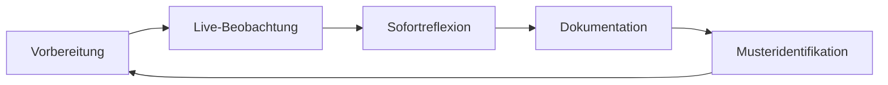
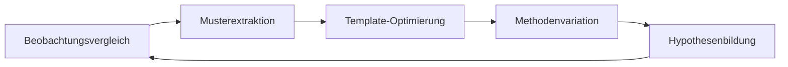
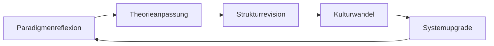

# Meta-Prozess: Selbstlernende Unterrichtsbeobachtung

## Systemische Grundlagen

### Autopoietische Beobachtungsorganisation
Die Beobachtungsumgebung konstituiert sich als operativ geschlossenes, aber informational offenes System, das durch rekursive Selbstreflexion kontinuierlich lernt und sich weiterentwickelt.

**Kernoperationen:**
1. **Beobachtung 1. Ordnung:** Direktes Beobachten der Unterrichtssituation
2. **Beobachtung 2. Ordnung:** Beobachtung der eigenen Beobachtungspraxis
3. **Beobachtung 3. Ordnung:** Reflexion der systemischen Beobachtungsstrukturen

---

## Selbstlernende Prozesszyklen

### Zyklus 1: Einzelbeobachtung (Mikro-Lernen)


**Adaptive Mechanismen:**
- **Real-time Anpassung:** Fokusverschiebung während Beobachtung
- **Emergenz-Erfassung:** Unerwartete Phänomene integrieren
- **Qualitätskontrolle:** Selbstreflexive Güteprüfung

### Zyklus 2: Sequenzlernen (Meso-Lernen)


**Aggregationsprozesse:**
- **Cross-Case-Analyse:** Vergleich mehrerer Beobachtungen
- **Pattern-Mining:** Wiederkehrende Strukturen identifizieren
- **Instrument-Evolution:** Templates kontinuierlich verfeinern

### Zyklus 3: Systemlernen (Makro-Lernen)


**Transformationsprozesse:**
- **Paradigm-Shift:** Grundlegende Annahmen hinterfragen
- **Emergente Theorie:** Neue Konzepte entwickeln
- **System-Architecture:** Strukturelle Neukonfiguration

---

## Adaptive Beobachtungsmatrix

### Komplexitätsstufen
| Stufe | Fokus | Methodologie | Selbstlernen |
|-------|-------|--------------|--------------|
| **Basic** | Beschreibung | Standardisiert | Template-Anpassung |
| **Advanced** | Analyse | Interpretativ | Muster-Erkennung |
| **Expert** | Systemik | Reflexiv | Theorie-Entwicklung |
| **Master** | Meta-Systemik | Transformativ | Paradigma-Innovation |

### Rückkopplungsebenen
```yaml
Immediate:
  - Real-time Fokusanpassung
  - Spontane Kategorienbildung
  - Situative Methodenwahl

Short-term:
  - Beobachtungsnachbereitung
  - Template-Modifikation
  - Qualitätskalibrierung

Medium-term:
  - Cross-session Vergleiche
  - Pattern-Dokumentation
  - Kompetenzentwicklung

Long-term:
  - Paradigmatische Reflexion
  - Systemische Innovation
  - Kulturelle Evolution
```

---

## Intelligente Dokumentationsarchitektur

### Semantic Linking
```yaml
Automatische_Verknüpfungen:
  - Thematische_Cluster: [[Tag:Werkhören]], [[Tag:Kreativität]]
  - Zeitliche_Sequenzen: [[Session:Previous]] → [[Session:Current]] → [[Session:Next]]
  - Akteurs_Netze: [[LAA:Name]] ↔ [[Beobachter:Name]] ↔ [[Klasse:ID]]
  - Konzeptuelle_Landkarten: [[Theorie:Systemtheorie]] ↔ [[Praxis:Unterricht]]
```

### Progressive Abstraktion
```yaml
Ebene_1_Konkret:
  - Wörtliche Zitate
  - Zeitgenaue Protokolle
  - Faktische Beschreibungen

Ebene_2_Interpretativ:
  - Muster-Identifikation
  - Kausale Vermutungen
  - Kontextuelle Einordnungen

Ebene_3_Konzeptuell:
  - Theoretische Modellierung
  - Systematische Abstraktion
  - Paradigmatische Reflexion

Ebene_4_Meta_Reflexiv:
  - Beobachtungs-Beobachtung
  - Systemische Selbstreflexion
  - Erkenntnistheoretische Grundlagen
```

---

## Qualitätssicherungssystem

### Selbstreflexive Validierung
```yaml
Objektivität:
  check: "Beobachter-Bias erkannt und dokumentiert?"
  action: "Perspektiventriangulation durchführen"
  learn: "Blindstellen-Mapping aktualisieren"

Reliabilität:
  check: "Beobachtungskonsistenz über Zeit?"
  action: "Instrumentkalibrierung durchführen"
  learn: "Stabilitätsmuster dokumentieren"

Validität:
  check: "Theoretische Fundierung gegeben?"
  action: "Konzept-Reality-Check durchführen"
  learn: "Konstruktvalidität überprüfen"
```

### Emergenz-Monitoring
```yaml
Schwache_Signale:
  - Unerwartete Schülerreaktionen
  - Innovative Lehrmethoden
  - Systemische Überraschungen

Trend_Detection:
  - Wiederholende Muster
  - Schleichende Veränderungen
  - Paradigmatische Verschiebungen

Innovation_Spots:
  - Kreative Lösungsansätze
  - Disruptive Momente
  - Systemische Durchbrüche
```

---

## Adaptive Algorithmen

### Pattern Recognition
```python
def pattern_detector(observations):
    # Temporale Muster
    temporal_patterns = extract_temporal_sequences(observations)
    
    # Strukturelle Muster  
    structural_patterns = identify_recurring_structures(observations)
    
    # Emergente Muster
    emergent_patterns = detect_novel_phenomena(observations)
    
    return synthesize_meta_patterns(temporal, structural, emergent)
```

### Learning Rate Adjustment
```python
def adaptive_learning_rate(observation_quality, pattern_stability, innovation_potential):
    if pattern_stability > threshold_high:
        # Exploitation: Bestehende Muster verfeinern
        learning_rate = conservative_rate
    elif innovation_potential > threshold_high:
        # Exploration: Neue Ansätze probieren
        learning_rate = aggressive_rate
    else:
        # Balance: Moderate Anpassung
        learning_rate = balanced_rate
    
    return learning_rate * observation_quality
```

---

## Feedback-Loops Integration

### Inter-Observer Learning
```yaml
Peer_Calibration:
  - Parallel-Beobachtungen vergleichen
  - Diskrepanz-Analyse durchführen
  - Konsens-Building-Prozesse

Expert_Feedback:
  - Supervisor-Validierung
  - Fachexpert-Consultation
  - Theorie-Praxis-Triangulation

Community_Learning:
  - Seminar-weite Muster
  - Best-Practice-Sharing
  - Kollektive Intelligenz
```

### System-Environment Coupling
```yaml
Lehrplan_Updates:
  - Neue Kompetenzmodelle integrieren
  - Methodische Innovationen berücksichtigen
  - Gesellschaftliche Entwicklungen reflektieren

Forschungs_Integration:
  - Aktuelle Studien einarbeiten
  - Methodische Fortschritte adoptieren
  - Theoretische Weiterentwicklungen

Praxis_Evolution:
  - Schulentwicklungen berücksichtigen
  - Technologische Innovationen
  - Kulturelle Veränderungen
```

---

## Implementation Roadmap

### Phase 1: Grundlagen (Wochen 1-4)
- [ ] Template-Kalibrierung
- [ ] Beobachter-Training
- [ ] Basis-Feedback-Loops

### Phase 2: Optimierung (Wochen 5-12)
- [ ] Pattern-Recognition aktivieren
- [ ] Adaptive Algorithmen implementieren
- [ ] Cross-Case-Learning etablieren

### Phase 3: Innovation (Wochen 13-24)
- [ ] Emergenz-Detection verfeinern
- [ ] Meta-Reflexion institutionalisieren
- [ ] System-Learning automatisieren

### Phase 4: Transformation (ab Woche 25)
- [ ] Paradigma-Review durchführen
- [ ] System-Architecture erneuern
- [ ] Kultur-Evolution initiieren

---

## Erfolgsmetriken

### Quantitative Indikatoren
```yaml
Effizienz:
  - Beobachtungszeit/Erkenntnisgewinn
  - Template-Anpassungsfrequenz
  - Pattern-Detection-Rate

Qualität:
  - Inter-Rater-Reliabilität
  - Prädiktive Validität
  - Theoretische Konsistenz

Innovation:
  - Neue Muster entdeckt
  - Methodische Durchbrüche
  - Paradigmatische Shifts
```

### Qualitative Indikatoren
```yaml
Adaptivität:
  - Flexibilität bei Ungeplantem
  - Lerngeschwindigkeit
  - Selbstreflexionstiefe

Emergenz:
  - Unerwartete Einsichten
  - Systemische Überraschungen
  - Kreative Syntheseleistungen

Nachhaltigkeit:
  - Wissensakkumulation
  - Strukturelle Stabilität
  - Kulturelle Integration
```

---

## Verknüpfungen
- [[DiSoAn_Methodologie]]
- [[Systemtheorie_Unterricht]]
- [[Luhmann_Beobachtungstheorie]]
- [[Template_Unterrichtsbeobachtung_Musik]]