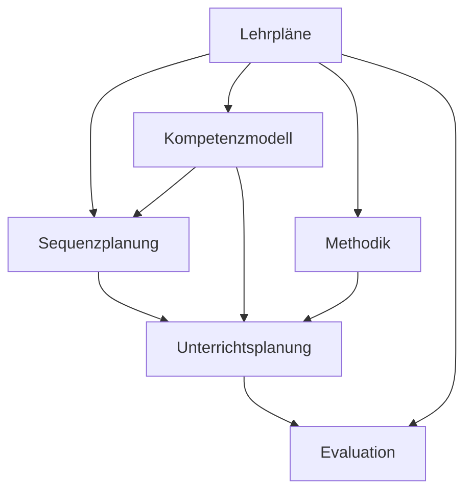

# Konzept: Integration der WiB-Lehrpläne in die Repository-Struktur

## 1. Systemische Einordnung

Die Lehrplandokumente bilden das strukturgebende Fundament für alle weiteren Materialien im WiB-Bereich. Sie stehen in direkter Beziehung zu:

- **Sequenzplanung**: Ableitung von Unterrichtssequenzen aus Lehrplaninhalten
- **Kompetenzmodell**: Operationalisierung der im Lehrplan formulierten Kompetenzen
- **Unterrichtsplanung**: Konkretisierung in Form von Unterrichtsentwürfen
- **Methodik**: Auswahl geeigneter Methoden zur Kompetenzförderung
- **Evaluation**: Überprüfung der im Lehrplan formulierten Kompetenzerwartungen



## 2. Metadatenschema für Lehrplandokumente

Jedes Lehrplandokument folgt einem einheitlichen Metadatenschema:

```yaml
---
typ: lehrplan
fach: WiB
jahrgangsstufe: [5-10]
lernbereich: [1-5 oder "alle"]
gegenstandsbereiche: 
  - [Arbeit|Berufsorientierung|Wirtschaft|Technik|Recht|Projekt|Übergreifend]
prozessbezogene_kompetenzen:
  - [Handeln|Analysieren|Kommunizieren|Beurteilen]
verknüpfte_dokumente:
  - Pfad zu verknüpften Dokumenten
bearbeitungsstand: [Entwurf|In Bearbeitung|Abgeschlossen]
letzte_aktualisierung: "YYYY-MM-DD"
---
```

## 3. Dokumententypologie im Lehrplankontext

### 3.1 Primäre Lehrplandokumente
- **Überblicksdokumente**: Zusammenfassende Darstellung aller Lernbereiche einer Jahrgangsstufe
- **Detaildokumente**: Ausführliche Darstellung einzelner Lernbereiche mit didaktischen Hinweisen
- **Planungshilfen**: Praktische Umsetzungshinweise zur Unterrichtsplanung

### 3.2 Sekundäre Lehrplandokumente
- **Metadokumente**: Konzeptionelle Einordnung und Nutzungshinweise
- **Verknüpfungsdokumente**: Systematische Verbindung zu anderen Bereichen des Repositories
- **Anwendungsbeispiele**: Exemplarische Umsetzungen in Form von Sequenz- oder Unterrichtsplanungen

## 4. Lehrplanbezogene Workflows

### 4.1 Erstellung von Sequenzplänen
1. Identifikation relevanter Lernbereiche und Kompetenzerwartungen
2. Analyse der Inhalte zu den Kompetenzen
3. Entwicklung eines Sequenzrasters mit Zuordnung von:
   - Kompetenzerwartungen
   - Inhaltlichen Schwerpunkten
   - Methodischen Zugängen
   - Evaluationsformen
4. Ausarbeitung der Sequenzplanung mit Verknüpfung der relevanten Lehrplandokumente

### 4.2 Entwicklung von Unterrichtsentwürfen
1. Auswahl konkreter Kompetenzerwartungen aus dem Lehrplan
2. Formulierung operationalisierter Lernziele nach dem Mager-Schema
3. Methodische Konkretisierung unter Berücksichtigung der Gegenstandsbereiche
4. Evaluation anhand der im Lehrplan formulierten Kompetenzerwartungen

### 4.3 Lehrplanbezogene Qualitätssicherung
1. Regelmäßige Überprüfung der Aktualität der Lehrplandokumente
2. Abgleich der Unterrichtsmaterialien mit den Lehrplanvorgaben
3. Systematische Dokumentation von Erfahrungen mit der Umsetzung
4. Iterative Optimierung der Lehrplandokumente und ihrer Verknüpfungen

## 5. Technische Aspekte der Lehrplanintegration

### 5.1 Dateinamenkonvention
- Format: `WiB[Jahrgangsstufe]_Lehrplan_[Lernbereich]_[Dokumenttyp].md`
- Beispiele:
  - `WiB5_Lehrplan_Ueberblick.md`
  - `WiB5_Lehrplan_LB2_Detail.md`
  - `WiB5_Lehrplan_Planungshilfe.md`

### 5.2 Verknüpfungsstrategie
- Bidirektionale Verlinkung zwischen Lehrplandokumenten und abhängigen Materialien
- Hierarchische Strukturierung von allgemeinen zu spezifischen Dokumenten
- Explizite Kennzeichnung von Abhängigkeiten und Vererbungsbeziehungen

### 5.3 Versionierungskonzept
- Datierte Versionen bei substanziellen Änderungen
- Dokumentation der Änderungen in einer Versionshistorie
- Beibehaltung älterer Versionen für Referenzzwecke

## 6. Anwendungsperspektiven

### 6.1 Für Lehrkräfte
- Schneller Überblick über relevante Lehrplaninhalte
- Direkte Verknüpfung mit konkreten Unterrichtsbeispielen
- Strukturierte Hilfen für die Sequenz- und Unterrichtsplanung

### 6.2 Für Fachbetreuung/Schulleitung
- Sicherstellung der Lehrplankonformität
- Unterstützung bei der schulinternen Curriculumsentwicklung
- Basis für kollegiale Zusammenarbeit und Materialentwicklung

### 6.3 Für Studienseminare
- Modellhafte Darstellung der Lehrplanumsetzung
- Strukturierte Grundlage für die Ausbildung von Referendarinnen und Referendaren
- Verknüpfung von Theorie und Praxis im Ausbildungskontext