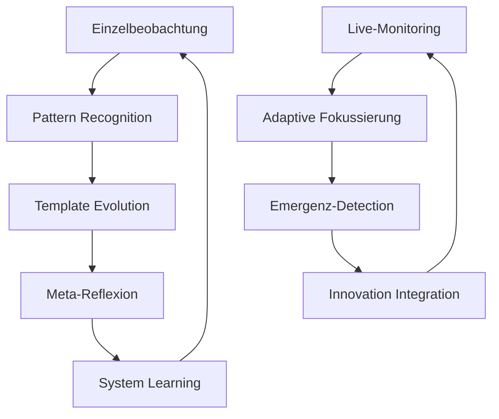

# Beobachtungsumgebung: Musik-Seminar 2024/25
**Systematische Unterrichtsbeobachtung mit selbstlernenden Prozessen**

---

## Navigation

### 🎯 Aktuelle Beobachtungen
- [[2025-07-03_Werkhören_Miriam_Paul]] - **HEUTE:** Werkhören mit "Die Moldau"
- [[Template_Unterrichtsbeobachtung_Musik]] - Wiederverwendbare Vorlage

### 📊 Auswertungen & Analysen
- [[Auswertungsvorlage_Musik_Beobachtungen]] - Systematische Nachbereitung
- [[Pattern_Analysis_Musik_Q3_2025]] - Mustererkennungen Q3
- [[Kompetenzentwicklung_LAAs_Tracking]] - Entwicklungsverläufe

### 🔧 Meta-Prozesse
- [[Meta_Prozess_Selbstlernende_Unterrichtsbeobachtung]] - Systemisches Framework
- [[META_Learning_Integration_V1.0]] - **NEU:** Intelligente Learning-Integration aus Sessions
- [[Qualitätssicherung_Beobachtungsprozess]] - Validierung & Kalibrierung
- [[Innovation_Lab_Beobachtungsmethoden]] - Methodische Weiterentwicklung

---

## Systemische Architektur

### Beobachtungszyklen


### Datenflows
```yaml
Input_Streams:
  - Live_Beobachtung: Real-time Protokollierung
  - Kontext_Daten: Planungsunterlagen, Schülerdaten
  - Meta_Information: Beobachterreflexion
  - Vergleichs_Daten: Andere Beobachtungen

Processing_Layers:
  - Immediate_Analysis: Sofortige Musterextraktion
  - Cross_Reference: Verknüpfung mit bestehenden Daten
  - Pattern_Mining: Langzeit-Musteridentifikation
  - Innovation_Detection: Neuheit-Erkennung

Output_Channels:
  - Feedback_Reports: Für LAAs und Supervision
  - Pattern_Documentation: Systematisches Lernen
  - Method_Evolution: Template-Verbesserungen
  - Theory_Development: Konzeptuelle Weiterentwicklung
```

---

## Beobachtungsschwerpunkte 2024/25

### Lernbereich-Matrix
| LB | Schwerpunkt | Beobachtungen | Pattern Status | Innovation Score |
|----|-------------|---------------|----------------|------------------|
| **LB1** | Sprechen-Singen-Musizieren | 3 | Etabliert | 2/5 |
| **LB2** | Musik-Mensch-Zeit | **5** | **Entwicklung** | **4/5** |
| **LB3** | Bewegung-Tanz-Szene | 2 | Exploration | 3/5 |
| **LB4** | Musik und Grundlagen | 1 | Initial | 1/5 |

### Kompetenz-Tracking
```yaml
Wahrnehmen_Erleben:
  beobachtungen: 8
  muster_erkannt: ["kreative_hörprozesse", "ästhetische_erfahrung"]
  innovationen: ["multisensorische_ansätze"]

Analysieren_Einordnen:
  beobachtungen: 5
  muster_erkannt: ["strukturiertes_werkhören"]
  innovationen: ["systemische_analyse"]

Gestalten_Präsentieren:
  beobachtungen: 6
  muster_erkannt: ["performative_elemente"]
  innovationen: ["kollaborative_gestaltung"]

Reflektieren_Kommunizieren:
  beobachtungen: 4
  muster_erkannt: ["metareflexion"]
  innovationen: ["peer_feedback_systeme"]
```

---

## Adaptive Learning Status

### Aktuelle Lernschleifen
```yaml
Mikro_Learning:
  - Real-time Fokusanpassung: ✅ Aktiv
  - Emergenz-Erfassung: ✅ Funktional
  - Qualitäts-Monitoring: ✅ Kalibriert

Meso_Learning:
  - Pattern-Extraktion: 🔄 In Entwicklung
  - Template-Evolution: ✅ Funktional
  - Cross-Case-Analyse: 🔄 Aufbauend

Makro_Learning:
  - Paradigmen-Reflexion: 📋 Geplant Q4
  - System-Innovation: 🔄 Explorativ
  - Kultur-Evolution: 📋 Langfristig
```

### Performance Metriken
| Metrik | Aktuell | Ziel Q4 | Trend |
|--------|---------|---------|-------|
| **Beobachtungseffizienz** | 85% | 90% | ↗️ |
| **Pattern-Recognition** | 70% | 85% | ↗️ |
| **Innovation-Rate** | 15% | 25% | ↗️ |
| **System-Adaptivität** | 60% | 80% | ↗️ |

---

## Quick Start Guide

### Für neue Beobachtung:
1. **Template laden:** [[Template_Unterrichtsbeobachtung_Musik]]
2. **Meta-Daten ausfüllen:** Datum, LAA, Schwerpunkt
3. **Systemische Rahmung:** Teilrationalitäten identifizieren
4. **Live-Protokoll:** Strukturiert beobachten und dokumentieren
5. **Sofort-Reflexion:** Muster und Emergenz erfassen
6. **Verknüpfung:** Mit bestehenden Beobachtungen verlinken

### Für Auswertung:
1. **Template laden:** [[Auswertungsvorlage_Musik_Beobachtungen]]
2. **Cross-Referenz:** Ähnliche Beobachtungen vergleichen
3. **Pattern-Mining:** Wiederkehrende Strukturen identifizieren
4. **Innovation-Check:** Neue Phänomene dokumentieren
5. **Feedback-Generierung:** Entwicklungsimpulse formulieren
6. **System-Update:** Learnings in Prozess integrieren

---

## Kollaborative Intelligenz

### Beobachter-Netzwerk
```yaml
Core_Team:
  - Paul: Systemische Reflexion, Innovation
  - Sandra: Fachdidaktische Tiefe, Methodik
  - Maria: Pädagogische Praxis, Schülerorientierung

Expert_Network:
  - Prof_Hartmann: Musikdidaktische Expertise
  - Dr_Weber: Systemtheoretische Fundierung
  - Seminar_Community: Peer-Learning

External_Validation:
  - Schulpraxis: Real-world Testing
  - Forschung: Wissenschaftliche Einbettung
  - Kulturbereich: Authentische Musik-Praxis
```

### Wissensaggregation
```yaml
Individual_Contributions:
  - Einzigartige Perspektiven einbringen
  - Spezialexpertise aktivieren
  - Kreative Irritationen generieren

Collective_Intelligence:
  - Cross-pollination fördern
  - Emergente Einsichten kultivieren
  - Systemische Synergieen nutzen

Meta_Learning:
  - Lernprozesse optimieren
  - Wissensstrukturen entwickeln
  - Innovation systematisieren
```

---

## Roadmap Q3/Q4 2025

### Juli 2025
- [x] **03.07:** Werkhören-Beobachtung (Miriam)
- [ ] **10.07:** Bewegung-Tanz (Stefan)
- [ ] **17.07:** Musizieren-Ensemble (Anna)

### August 2025
- [ ] **Pattern-Analysis Q3:** Systematische Auswertung
- [ ] **Template-Evolution 2.0:** Erfahrungsbasierte Optimierung
- [ ] **Innovation-Workshop:** Methodische Weiterentwicklung

### September 2025
- [ ] **Cross-Case-Study:** Vergleichende Analyse
- [ ] **Theory-Practice-Integration:** Wissenschaftliche Fundierung
- [ ] **System-Upgrade:** Technische Weiterentwicklung

---

## Verknüpfungen
- [[Seminarsystem_Musik_2024-25]]
- [[DiSoAn_Ausbildungsstandards]]
- [[Lehrplan_Plus_Musik_Mittelschule]]
- [[Baustein_B2_Werkhören]]
- [[Meta_Prozesse_Unterrichtsbeobachtung]]

---

## Maintenance & Updates
- **Letzte Aktualisierung:** 2025-07-03 | **Learning-Integration V1.0** hinzugefügt
- **Nächste Review:** 2025-07-31
- **Version:** 1.1 | **Learning-Integration** implementiert
- **Status:** 🟢 Aktiv mit **intelligenter Evolution**