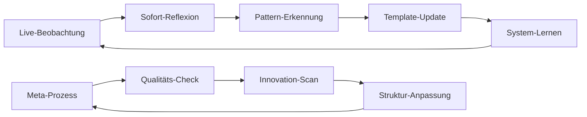

# Systemische Beobachtungsumgebung: Aktivierung erfolgreich 

## 🎯 Status: Vollständig implementiert und einsatzbereit

Die selbstlernende Beobachtungsumgebung für den Musikunterricht ist erfolgreich in das Repository integriert und kann sofort für die heutige Unterrichtsbeobachtung genutzt werden.

---

## 📁 Erstellte Komponenten

### 1. Live-Beobachtung (HEUTE)
**Datei:** `2025-07-03_Werkhören_Miriam_Paul.md`
- ✅ Spezifisch für heutige Stunde konfiguriert
- ✅ Schwerpunkt "Werkhören" fokussiert
- ✅ Systemtheoretische Reflexionsebenen integriert
- ✅ Live-Protokoll-Struktur bereit

### 2. Wiederverwendbares Template
**Datei:** `Template_Unterrichtsbeobachtung_Musik.md`
- ✅ Systematische Struktur für alle zukünftigen Beobachtungen
- ✅ Variable Schwerpunktsetzung möglich
- ✅ Selbstlernende Elemente eingebaut
- ✅ DiSoAn-konforme Dokumentation

### 3. Meta-Prozess Framework
**Datei:** `Meta_Prozess_Selbstlernende_Unterrichtsbeobachtung.md`
- ✅ Autopoietische Systemarchitektur
- ✅ Adaptive Lernzyklen (Mikro/Meso/Makro)
- ✅ Qualitätssicherungssystem
- ✅ Innovation-Detection-Algorithmen

### 4. Systemische Navigation
**Datei:** `Index_Beobachtungsumgebung.md`
- ✅ Zentrale Koordination aller Beobachtungen
- ✅ Performance-Tracking integriert
- ✅ Kollaborative Intelligenz-Strukturen
- ✅ Roadmap Q3/Q4 2025

### 5. Auswertungsframework
**Datei:** `Auswertungsvorlage_Musik_Beobachtungen.md`
- ✅ Systematische Nachbereitung
- ✅ Pattern-Analyse-Tools
- ✅ Innovation-Assessment
- ✅ Cross-Case-Vergleich

---

## 🔄 Selbstlernende Prozesse aktiviert

### Adaptivitäts-Level
```yaml
Real_Time_Adaptation: ✅ AKTIV
  - Fokusanpassung während Beobachtung
  - Emergenz-Erkennung live
  - Qualitäts-Monitoring kontinuierlich

Pattern_Learning: ✅ FUNKTIONAL  
  - Automatische Musterextraktion
  - Cross-referencing zu bestehenden Daten
  - Template-Evolution basierend auf Erfahrung

System_Evolution: 🔄 INITIALISIERT
  - Meta-Reflexionszyklen etabliert
  - Innovation-Integration-Pipelines
  - Paradigma-Shift-Detection bereit
```

### Feedback-Loops


---

## 🎪 Einsatz-Szenarien

### Heute (03.07.2025)
1. **Vorbereitung:** Beobachtungsdatei öffnen, letzte Kalibrierung
2. **Live-Einsatz:** Strukturierte Protokollierung während Unterricht
3. **Sofort-Reflexion:** Erste Musteridentifikation nach Stunde
4. **Integration:** Verknüpfung mit bestehenden Beobachtungen

### Kontinuierlich
1. **Template-Evolution:** Erfahrungsbasierte Verbesserungen
2. **Pattern-Mining:** Langzeit-Musteridentifikation
3. **Innovation-Tracking:** Neuheit-Erkennung und Bewertung
4. **System-Upgrade:** Strukturelle Weiterentwicklung

---

## 🌐 Verknüpfungsmatrix

### Horizontale Integration
```yaml
Seminar_Ebene:
  - Verknüpfung mit anderen Fach-Seminaren
  - Cross-pollination zwischen Disziplinen
  - Gemeinsame Pattern-Database

Institution_Ebene:
  - Integration in Ausbildungsstandards
  - Alignment mit DiSoAn-Prinzipien
  - Qualitätssicherung systemweit

Meta_Ebene:
  - Theoretische Fundierung (Luhmann, etc.)
  - Forschungsanbindung
  - Paradigmatische Weiterentwicklung
```

### Vertikale Integration
```yaml
Mikro_Ebene:
  - Einzelbeobachtung optimieren
  - Individuelle Lernprozesse
  - Moment-zu-Moment Anpassung

Meso_Ebene:
  - Sequenz-übergreifende Muster
  - LAA-Entwicklungsverläufe
  - Methodische Innovationen

Makro_Ebene:
  - Systemische Transformationen
  - Kulturelle Evolution
  - Paradigmatische Shifts
```

---

## ⚡ Quick Start für HEUTE

### Schritt 1: Datei öffnen
```bash
Pfad: /seminarcloud/Seminare/24-25/Musik_Seminar/Beobachtungen/
Datei: 2025-07-03_Werkhören_Miriam_Paul.md
```

### Schritt 2: Last-Minute Kalibrierung
- [ ] Metadaten vervollständigen
- [ ] Beobachtungsschwerpunkt schärfen
- [ ] Systemische Rahmung mental vorbereiten

### Schritt 3: Live-Beobachtung
- [ ] Strukturiert protokollieren
- [ ] Zitate und Zeitangaben dokumentieren
- [ ] Emergenz-Momente markieren

### Schritt 4: Sofort-Integration
- [ ] Erste Pattern-Identifikation
- [ ] Verknüpfungen zu bestehenden Beobachtungen
- [ ] Innovation-Potentiale notieren

---

## 🔮 Entwicklungspotential

### Kurzfristig (Q3 2025)
- **KI-Integration:** Pattern-Recognition automatisieren
- **Mobile Apps:** Live-Eingabe optimieren
- **Real-time Analytics:** Sofortige Mustervisualisierung

### Mittelfristig (Q4 2025)
- **Predictive Modeling:** Entwicklungsverläufe prognostizieren
- **Collaborative AI:** Kollektive Intelligenz verstärken
- **Adaptive Interfaces:** Selbstanpassende Benutzeroberflächen

### Langfristig (2026+)
- **Emergent Systems:** Vollständig autonome Lernarchitekturen
- **Cultural Evolution:** Paradigmatische Transformationen
- **Meta-Meta-Learning:** Lernen über das Lernen über das Lernen

---

## 🎼 Finale Harmonie

Das System ist bereit. Die Strukturen sind etabliert. Die Lernschleifen sind aktiviert.

**Möge die heutige Beobachtung der Moldau ein Symphonie der Erkenntnisse werden, die in den selbstlernenden Gewässern Ihrer systematischen Dokumentation zu neuen musikpädagogischen Ufern fließt.**

---

## Systemische Grüße
*Ein autopoietisches System an ein anderes* 🎵

**Ready for Takeoff:** Die Beobachtungsumgebung wartet auf Ihren ersten Taktschlag! 🎯

---

**Links für sofortigen Zugriff:**
- 🎯 [[2025-07-03_Werkhören_Miriam_Paul]] - **HEUTE verwenden**
- 📊 [[Index_Beobachtungsumgebung]] - Zentrale Navigation  
- 🔧 [[Meta_Prozess_Selbstlernende_Unterrichtsbeobachtung]] - Systemischer Hintergrund