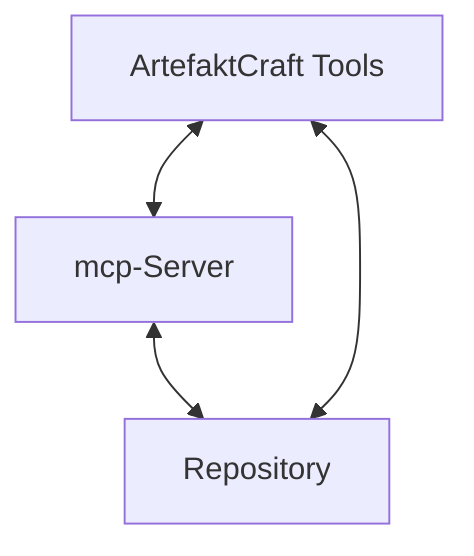

# ArtefaktCraft

**ArtefaktCraft** ist ein integriertes Werkzeug zur standardisierten Erstellung hochwertiger Unterrichtsmaterialien. Es kombiniert strukturierte Dokumentation, metadatengesteuerte Prozesse und fortschrittliche mcp-Server-Integration.

## Zielsetzung

ArtefaktCraft unterstützt Lehrkräfte bei der effizienten Erstellung konsistenter, hochwertiger Unterrichtsmaterialien durch:

1. **Standardisierung**: Einheitliche Strukturen und Metadaten für alle Materialien
2. **Automatisierung**: Reduzierung manueller Arbeitsschritte durch intelligente Unterstützung
3. **Qualitätssicherung**: Integrierte Prüfmechanismen zur Sicherung fachspezifischer Standards
4. **Vernetzung**: Dynamische Verknüpfung von zusammengehörigen Materialien
5. **Wiederverwendbarkeit**: Modulare Komponenten für effiziente Materialerstellung

## Architektur

ArtefaktCraft basiert auf einer modularen Architektur mit drei Hauptkomponenten:

1. **ArtefaktCraft Tools**: Command-Line-Werkzeuge zur Materialerstellung
2. **mcp-Server**: Middleware für dynamische Ressourcenverwaltung und Metadatenvalidierung
3. **Git Repository**: Speicher für Materialien und Metadaten in Markdown-Format

## Erste Schritte

1. [Setup](setup.md) - Komplette Installationsanleitung
2. [Workflow](workflow.md) - Standardisierter Erstellungsprozess
3. [Schemas](schemas/README.md) - Metadatendefinitionen

## Tools im Überblick

ArtefaktCraft bietet folgende Hauptwerkzeuge:

| Tool | Beschreibung | Verwendung |
|------|-------------|-----------|
| `create-material.js` | Erstellt neue Materialien aus Templates | `node create-material.js --template=ue_wib_standard --metadata=meta.yaml --output=output.md` |
| `quality-check.js` | Prüft Materialien auf Qualitätsstandards | `node quality-check.js --file=material.md` |
| `link-resources.js` | Verwaltet dynamische Ressourcenverknüpfungen | `node link-resources.js check --file=material.md` |

## mcp-Server Integration

ArtefaktCraft ist eng mit dem mcp-Server verzahnt, der folgende Dienste bereitstellt:

- **Ressourcen-Indexierung**: Automatische Erfassung und Kategorisierung aller Materialien
- **Metadaten-Validierung**: Prüfung gegen definierte Schemas
- **Dynamische Verlinkung**: Auflösung und Verwaltung von Ressourcenverknüpfungen
- **Curriculum-Zugriff**: Integration von Lehrplaninhalten in Materialien
- **Ähnlichkeitsanalyse**: Identifikation ähnlicher oder verwandter Materialien

Der mcp-Server ist über eine REST-API unter `http://localhost:3000` erreichbar und bietet Endpunkte wie:

- `/resources` - Listet alle verfügbaren Ressourcen auf
- `/templates` - Stellt Materialvorlagen bereit
- `/validate/metadata` - Validiert Metadaten gegen Schemas
- `/curriculum` - Liefert Lehrplaninhalte basierend auf Metadaten

## Materialtypen

ArtefaktCraft unterstützt verschiedene Materialtypen, darunter:

- **Unterrichtseinheiten**: Detaillierte Planungen einzelner Unterrichtsstunden
- **Sequenzplanungen**: Übergreifende Planung mehrerer zusammenhängender Stunden
- **Tafelbilder**: Visualisierungen für den Unterricht
- **Arbeitsblätter**: Aufgaben und Materialien für Schülerinnen und Schüler

Jeder Materialtyp wird durch ein eigenes Metadatenschema definiert und hat spezifische Templates und Qualitätsstandards.

## Entwicklung und Erweiterung

ArtefaktCraft ist modular aufgebaut und kann erweitert werden:

- **Neue Templates**: Erstellen Sie Templates in `templates/` für spezifische Anwendungsfälle
- **Schemas erweitern**: Anpassen der Schemas in `schemas/` für zusätzliche Metadaten
- **Tool-Entwicklung**: Implementieren Sie neue Tools in `scripts/` für zusätzliche Funktionen

## Lizenz

ArtefaktCraft steht unter der [MIT-Lizenz](LICENSE).

---

*ArtefaktCraft - Standardisierte Qualität für den Unterricht*