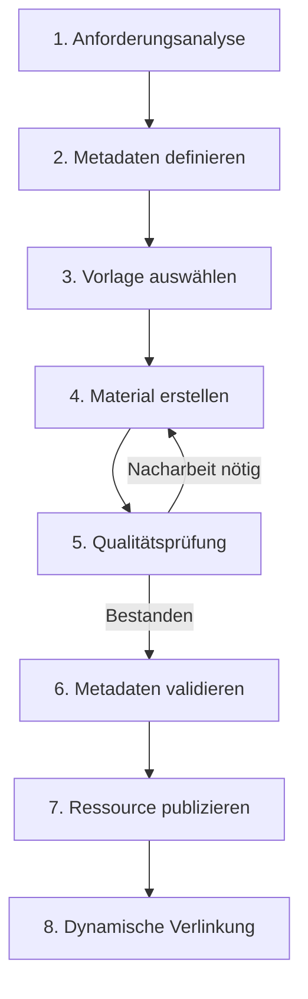

# ArtefaktCraft: Standardisierter Workflow

Dieser Leitfaden beschreibt den standardisierten Workflow zur Erstellung hochwertiger Unterrichtsmaterialien mit ArtefaktCraft und dem mcp-Server.

## Übersicht des Workflows



## Detaillierte Schritte

### 1. Anforderungsanalyse

Vor der Erstellung eines neuen Unterrichtsmaterials:

- Identifizieren Sie den genauen Materialtyp (Unterrichtseinheit, Tafelbild, Sequenzplanung, etc.)
- Definieren Sie die Zielgruppe (Jahrgangsstufe, Leistungsniveau)
- Klären Sie den curricularen Bezug (Lernbereich, Kompetenzerwartungen)
- Erfassen Sie vorhandene verknüpfte Materialien

Nutzen Sie den mcp-Server zur Abfrage ähnlicher bereits vorhandener Materialien:
```bash
curl http://localhost:3000/resources?subject=WiB&grade=7&topic=Wirtschaft
```

### 2. Metadaten definieren

Erstellen Sie eine vollständige Metadatenstruktur gemäß dem YAML-Format:

```yaml
---
type: unterrichtseinheit
title: "Titel der Unterrichtseinheit"
subject: "WiB"  
grade: "7"      
topic: "Wirtschaft" 
subtopic: "Marktformen"
learningAreas: ["LB3"]
competencyAreas: ["Wirtschaft"]
processCompetencies: ["Analysieren", "Beurteilen"]
duration: "90" # Minuten
prerequisites: ["Grundlagen Angebot und Nachfrage"]
resources: ["Arbeitsblatt Marktformen", "Tafelbild Preisbildung"]
author: "Max Mustermann"
created: "2025-05-10"
modified: "2025-05-10"
version: "1.0.0"
status: "final" # draft, review, final
---
```

Nutzen Sie den mcp-Server zur Validierung Ihrer Metadaten:
```bash
curl -X POST -H "Content-Type: application/json" -d @metadata.json http://localhost:3000/validate/metadata
```

### 3. Vorlage auswählen

Wählen Sie die passende ArtefaktCraft-Vorlage basierend auf dem Materialtyp:

```bash
node ./tools/artefaktcraft/select-template.js --type=unterrichtseinheit --subject=WiB
```

Der mcp-Server stellt eine Liste verfügbarer Vorlagen bereit:
```bash
curl http://localhost:3000/templates?type=unterrichtseinheit&subject=WiB
```

### 4. Material erstellen

Erstellen Sie das Material unter Verwendung der ausgewählten Vorlage:

```bash
node ./tools/artefaktcraft/create-material.js --template=ue_wib_standard --metadata=metadata.yaml --output=notizen/wib/unterricht/07_UE_Marktformen.md
```

Der mcp-Server unterstützt die Erstellung durch:
- Bereitstellung der Vorlagendatei
- Befüllung dynamischer Elemente (z.B. Lehrplan-Auszüge)
- Generierung von Ressourcen-IDs für die spätere Verlinkung

### 5. Qualitätsprüfung

Führen Sie eine automatisierte Qualitätsprüfung durch:

```bash
node ./tools/artefaktcraft/quality-check.js --file=notizen/wib/unterricht/07_UE_Marktformen.md
```

Der mcp-Server prüft:
- Vollständigkeit der Metadaten
- Korrekte Strukturierung gemäß Vorlage
- Konsistenz der Verlinkungen
- Einhaltung fachspezifischer Standards

### 6. Metadaten validieren

Validieren Sie die finalisierten Metadaten gegen das Schema:

```bash
node ./tools/artefaktcraft/validate-metadata.js --file=notizen/wib/unterricht/07_UE_Marktformen.md
```

Der mcp-Server liefert eine detaillierte Validierungsantwort mit Hinweisen auf Optimierungspotenziale.

### 7. Ressource publizieren

Fügen Sie die neue Ressource zur Repository hinzu:

```bash
git add notizen/wib/unterricht/07_UE_Marktformen.md
git commit -m "Add: Unterrichtseinheit zu Marktformen (WiB, Jgst. 7)"
git push
```

Der mcp-Server aktualisiert automatisch seinen Ressourcen-Index und macht die neue Ressource verfügbar.

### 8. Dynamische Verlinkung

Referenzieren Sie die neue Ressource in anderen Materialien über ihre eindeutige ID:

```markdown
Siehe auch die [Unterrichtseinheit zu Marktformen](mcp://resource/wib_ue_marktformen_7).
```

Der mcp-Server löst diese dynamischen Links auf und stellt sicher, dass sie immer auf die aktuelle Version der Ressource verweisen.

## Automatisierte Unterstützung

ArtefaktCraft bietet folgende automatisierte Unterstützung im Workflow:

- **Metadaten-Generator**: Erstellt Metadatenvorschläge basierend auf Dateiname und -pfad
- **Template-Finder**: Schlägt passende Vorlagen basierend auf Materialtyp vor
- **Lehrplan-Integrator**: Bindet relevante Lehrplaninhalte automatisch ein
- **Qualitätsprüfer**: Führt automatisierte Qualitätschecks durch
- **Ressourcen-Linker**: Schlägt relevante zu verlinkende Ressourcen vor

Alle diese Tools kommunizieren mit dem mcp-Server, um auf aktuelle Ressourcen und Metadaten zuzugreifen.
