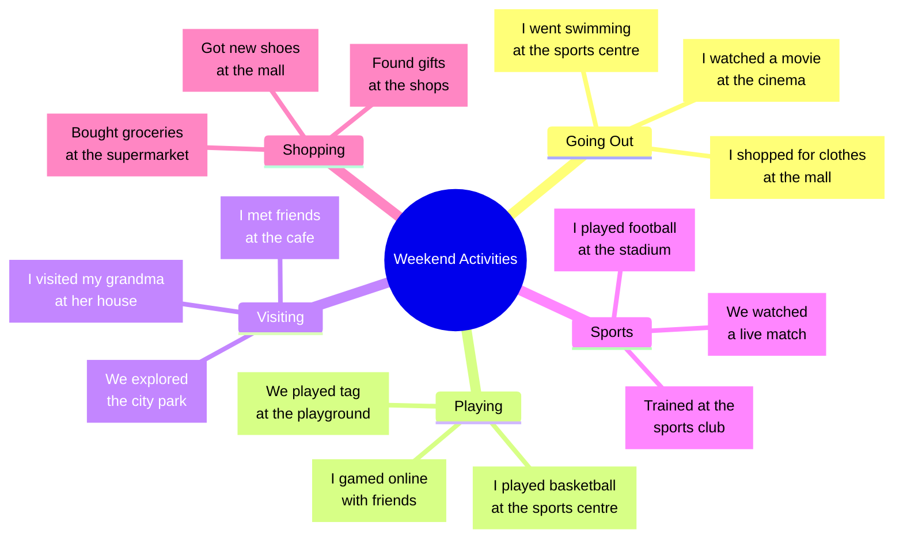

# Tafel-Mindmap: Activities in Town - Konzept für BUV

## Skizze des antizipierten Tafelbilds

*Mindmap = Zentrale Ressource für authentische Dialoge über das vergangene Wochenende*

## Erklärungen
Die Mindmap wird **gemeinsam mit den SuS** an der Tafel entwickelt und dient als **permanente Sichtbarhilfe** während der gesamten Stunde.

## Aufbau-Strategie

### Phase 1: Zentrum setzen
```
           🏘️ Activities in Town
```

### Phase 2: 5 Grundverben (Präsens) anordnen
```
         TO GO    TO PLAY
              \  /
    Activities in Town -- TO BUY
             /  \
        TO WATCH  TO VISIT
```

### Phase 3: SuS ergänzen mit Wortkarten (Präsens → Simple Past)
- **Wortkarten** werden von SuS aufgeklappt: `play → played`
- **Orte** werden ergänzt: `play football → at the stadium`
- **Details** durch SuS-Beiträge: `with friends`, `with family`

## Struktur der finalen Mindmap

### Grundverben (5 Hauptäste) - Unit 5
1. **TO GO** → WENT
   - go swimming → swimming pool
   - go shopping → shopping centre  
   - go to the cinema → cinema

2. **TO PLAY** → PLAYED
   - play football → stadium/park
   - play computer games → at home
   - play with friends → playground

3. **TO WATCH** → WATCHED
   - watch TV → at home
   - watch a film → cinema
   - watch football → stadium

4. **TO VISIT** → VISITED
   - visit grandma → grandma's house
   - visit friends → friend's house
   - visit the park → park

5. **TO BUY** → BOUGHT
   - buy clothes → shopping centre
   - buy food → supermarket
   - buy presents → shops

## Umsetzung im Klassenzimmer

### Materialien
- **Große Wortkarten** (A4) mit Klapp-Mechanismus an Tafel:
  - Vorderseite: `PLAY` (grün)
  - Aufgeklappt: `PLAYED` (rot)
- Verschiedenfarbige Kreide zum notieren der SuS-Äußerungen (Orte etc.) und Zeichnungen
### Timing (7 Minuten)
1. **Min 1-2:** Zentrum + 5 Verben positionieren
2. **Min 3-5:** SuS ergänzen Aktivitäten und Orte
3. **Min 6-7:** Simple Past durch Aufklappen zeigen

### Sichtbarkeit
- **Bleibt die ganze Stunde sichtbar**
- **Beamer zeigt anschließend gleichzeitig** den digitalen Beispieldialog
- **SuS können jederzeit** darauf zugreifen

## Verbindung zum Dialog-Konzept

Die Mindmap liefert **alle Bausteine für die Dialoge**:
- **Fragen:** "Where did you go?" → Orte aus der Mindmap
- **Antworten:** "I went to the stadium" → Verben + Orte kombinieren
- **Follow-ups:** "What did you do there?" → Aktivitäten aus der Mindmap

## Differenzierung durch die Mindmap

### Einfaches Niveau (Green Cards)
- Nutzt **nur die Hauptäste** (5 Verben + 1 Ort)
- Beispiel: "I went to the park. I played football."

### Standardniveau (Yellow Cards)  
- Kombiniert **mehrere Äste** (2-3 Aktivitäten)
- Beispiel: "I went shopping and visited friends."

### Fortgeschrittenes Niveau (Extension)
- **Eigene Ergänzungen** zur Mindmap
- **Zeit- und Begleitungsangaben**: "On Saturday morning with my dad"

---
