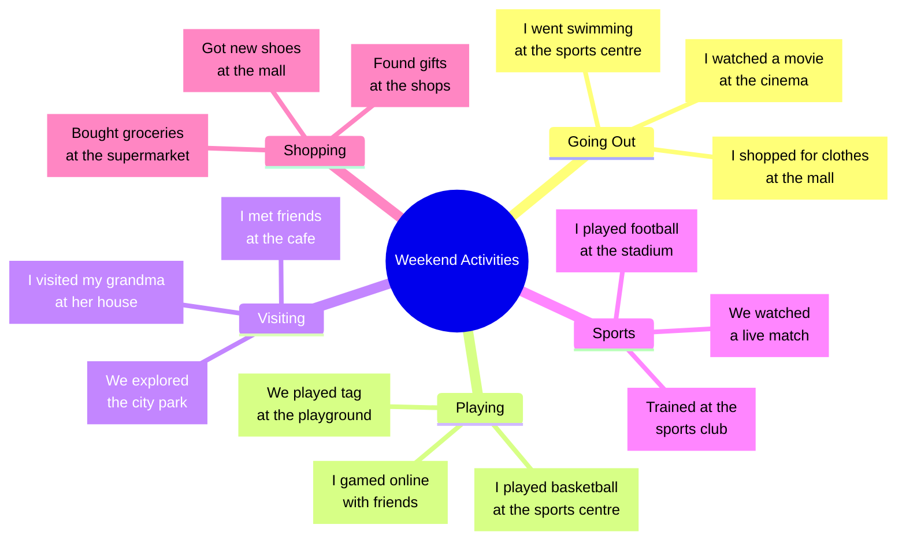

# 2. Stundenskizze - Englisch "My Weekend"

**Staatliches Studienseminar für Lehrerausbildung SW - V**
**Seminarjahr:** 2024/25  

---

## Stundenskizze

**Datum:** 25.06.2025, 07:55 - 08:40
**Klasse:** E5b (22 SuS)  
**Fach:** Englisch  
**Sequenz:** Unit 5 "People and Places"  
**Thema:** Speaking - "My Weekend" - Dialogische Kommunikation über Wochenend-Aktivitäten  

---

## Inhalt

[1. Sequenzbeschreibung](#1-sequenzbeschreibung)  
[2. Thema der Unterrichtseinheit](#2-thema-der-unterrichtseinheit)  
[3. Lernziele](#3-lernziele)  
[4. Ergänzende Hinweise zur Stellung der Stunde im amtlichen Lehrplan](#4-ergänzende-hinweise-zur-stellung-der-stunde-im-amtlichen-lehrplan)  
[5. Didaktische Reduktion](#5-didaktische-reduktion)  
[6. Methodische Analyse](#6-methodische-analyse)  
[7. Stundenskizze (Verlaufsplanung)](#7-stundenskizze-verlaufsplanung)  
[8. Medien und Materialien](#8-medien-und-materialien)  
[9. Literaturverzeichnis](#9-literaturverzeichnis)  
[10. Eigenständigkeitserklärung](#10-eigenständigkeitserklärung)  

---

<div style="page-break-after: always;"></div>

## 1. Sequenzbeschreibung

### Unit 5 "People and Places" - Blue Line 1

Die Unterrichtssequenz "People and Places" umfasst 12 Unterrichtsstunden und fokussiert sich auf die kommunikative Kompetenz des Sprechens im Kontext von Freizeitaktivitäten und Ortsangaben. Die Schülerinnen und Schüler erwerben systematisch die Fähigkeit, über vergangene Ereignisse zu sprechen und dabei die grammatische Struktur des Simple Past anzuwenden.

**Sequenzübersicht:**

**Sequenztitel:** Unit 5 - People and Places: Interkulturelle Kompetenzen und Vergangenheitsformen

**Lehrkraft:** LAA Paul Cebulla (Mo/Mi/Fr), Mentorin Frau Katzenberger (Di/Do)

**Lehrplanbezug:** E5, Lernbereich 1: Kommunikative Kompetenzen, Lernbereich 2: Interkulturelle Kompetenzen, Lernbereich 5: Themengebiete

**Kompetenzerwartungen:**
- Die Schülerinnen und Schüler verstehen einfache Äußerungen zu Themen aus ihrem Erfahrungsbereich (z. B. Familie, Tagesablauf), wenn deutlich gesprochen wird.
- Sie berichten und erzählen von Tätigkeiten und Ereignissen aus ihrem unmittelbaren Erfahrungsbereich mithilfe grundlegender Strukturen (simple past).
- Sie verfügen über grundlegende Kenntnisse zur geographischen Lage und politischen Gliederung Großbritanniens.
- Sie beschreiben routinemäßige und vergangene Handlungen mithilfe grundlegender Zeitformen (simple present, simple past).

**Inhalte zu den Kompetenzen:**
- Großbritannien: grundlegender Einblick in die geographische und politische Gliederung
- Aspekte des Alltagslebens: Familie und Freunde, Wohnen, Tagesablauf
- Grammatik: simple past (was/were, regelmäßige Verben mit -ed)
- Wortschatz: ca. 50 neue Wörter zu Großbritannien und Alltagsleben (S. 82-90)

**Grundlegende Kompetenzen (Jahrgangsstufenprofil):**
Die Schülerinnen und Schüler erweitern ihre interkulturelle Kompetenz durch Grundwissen zu Großbritannien und entwickeln ihre kommunikativen Fertigkeiten durch systematische Einführung der Vergangenheitsformen.

<div style="page-break-after: always;"></div>

#### 1.2 Sequenzübersicht

| UZE                                    | Datum        | Wochentag | Lehrkraft       | Stundenthema                            | Kompetenzbereich          | Schwerpunkt     | Stundenziel/Kompetenzerwartung                                                                                                                                                                                                        | Kommentar zu Inhalt/Verfahren                                                          | Material                                                             | Querverbindung       |
| -------------------------------------- | ------------ | --------- | --------------- | --------------------------------------- | ------------------------- | --------------- | ------------------------------------------------------------------------------------------------------------------------------------------------------------------------------------------------------------------------------------- | -------------------------------------------------------------------------------------- | -------------------------------------------------------------------- | -------------------- |
| 1                                      | 28.05.25     | Mi        | LAA Cebulla     | People and places - Einführung S. 82-83 | Leseverstehen             | Interkulturell  | Die SuS erschließen grundlegende Informationen zu englischsprachigen Ländern, indem sie bildgestützte Texte lesen, was daran erkennbar wird, dass sie mindestens drei Länder mit charakteristischen Merkmalen benennen können.        | Bucharbeit S. 82-83, Eckenspiel Vokabeln, Berücksichtigung DaZ-SuS                     | LB S. 82-83, Vokabelkarten                                           | GPG: Länderkunde     |
| 2                                      | 30.05.25     | Fr        | LAA Cebulla     | People and places - Vertiefung S. 82-83 | Sprechen                  | Kommunikativ    | Die SuS tauschen sich über Reiseerfahrungen aus, indem sie einfache Dialoge führen, was daran erkennbar wird, dass sie in Partner-Interviews mindestens drei Fragen stellen und beantworten können.                                   | Vokabelwiederholung, Speaking activities, Bewegung für aktive Klasse                   | Partner-Karten, Audio-CD                                             | WiB: Reisen          |
| 3                                      | 02.06.25     | Mo        | LAA Cebulla     | What do you know about Great Britain?   | Interkulturelle Kompetenz | Landeskundlich  | Die SuS erweitern ihre Kenntnisse über Großbritannien, indem sie geographische Informationen sammeln und ordnen, was daran erkennbar wird, dass sie eine Mindmap mit mindestens 8 Begriffen erstellen können.                         | Kartenarbeit, Quiz zu britischen Besonderheiten, visuelle Unterstützung                | GB-Karte, Quiz-Materialien                                           | GPG: Europa          |
| 4                                      | 04.06.25     | Mi        | LAA Cebulla     | It's Monday morning S. 84-85            | Hörverstehen              | Kommunikativ    | Die SuS verstehen Informationen zu britischen Tagesabläufen, indem sie einen Hörtext global und selektiv erschließen, was daran erkennbar wird, dass sie mindestens 5 Detailinformationen nennen können.                              | Hörtext S. 84-85, Audio-Unterstützung für LRS-SuS, Vergleich eigener Montag            | LB S. 84-85, Audio-CD                                                | Familie/Alltag       |
| 5                                      | 06.06.25     | **Fr**    | **LAA Cebulla** | **Was or were? Wasn't, Weren't S. 86**  | **Grammatik**             | **Strukturell** | **Die SuS erkennen die Bildung von was/were/wasn't/weren't, indem sie Beispielsätze analysieren, was daran erkennbar wird, dass sie die Formen korrekt den Personalpronomen zuordnen und in einfachen Sätzen anwenden können.**       | **Induktive Regelbildung S. 86, Drill-Übungen, Bewegungsspiele für hohe Aktivität**    | **LB S. 86, Konjugationskarten**                                     | **D: Vergangenheit** |
| **Pfingstferien: 10.06. - 20.06.2025** |              |           |                 |                                         |                           |                 |                                                                                                                                                                                                                                       |                                                                                        |                                                                      |                      |
| 6                                      | 23.06.25     | Mo        | LAA Cebulla     | Verben in der Vergangenheit S. 87       | Grammatik                 | Strukturell     | Die SuS bilden regelmäßige Vergangenheitsformen, indem sie die -ed Regel entdecken und anwenden, was daran erkennbar wird, dass sie mindestens 8 Verben korrekt transformieren können.                                                | Regelentdeckung S. 87, Pantomime-Spiele, kinesthetisches Lernen                        | LB S. 87, Verb-Karten                                                | D: Zeitformen        |
| 7                                      | **25.06.25** | **Mi**    | **LAA Cebulla** | **BUV:  Speaking**                      | **Alle Fertigkeiten**     | **Integrativ**  | **Die Schülerinnen und Schüler können in strukturierten Partnerdialogen über ihr vergangenes Wochenende sprechen, indem sie sowohl Fragen stellen als auch detaillierte Antworten geben und dabei das Simple Past korrekt anwenden.** | **Prüfungssituation: Listening S. 90 + Speaking activities, differenzierte Bewertung** | **LB S.88-90 & S.167, Dialogue-Cards, Mindmap, Bilder, Exit-Ticket** | **Assessment**       |
| 8                                      | 27.06.25     | Fr        | LAA Cebulla     | Yesterday activities S. 88              | Sprechen/Anwendung        | Kommunikativ    | Die SuS berichten über vergangene Aktivitäten, indem sie simple past in eigenen Sätzen verwenden, was daran erkennbar wird, dass sie einen kurzen Monolog über ihr Wochenende halten können.                                          | Anwendung S. 88, freie Sprechzeit, Festigung der Sequenz                               | LB S. 90-91, Bildkarten                                              | Lebenswelt SuS       |

**Zusätzliche Stunden bei Mentorin Frau Katzenberger (Di/Do):**

| UZE | Datum    | Lehrkraft         | Stundenthema                   | Schwerpunkt   |
|-----|----------|-------------------|-------------------------------|--------------|
| A   | 29.05.25 | Frau Katzenberger | Wiederholung Unit 4           | Festigung    |
| B   | 03.06.25 | Frau Katzenberger | Vocabulary building Unit 5    | Wortschatz   |
| C   | 05.06.25 | Frau Katzenberger | Reading skills practice       | Leseverstehen|
| D   | 24.06.25 | Frau Katzenberger | Grammar practice simple past  | Grammatik    |
| E   | 26.06.25 | Frau Katzenberger | Project work Britain          | Anwendung    |

##### 1.3 Fachliche Einordnung

Die Unterrichtssequenz "People and Places" bildet den Auftakt zu einem systematischen Aufbau interkultureller und sprachlicher Kompetenzen im Englischunterricht der 5. Jahrgangsstufe. Nach den grundlegenden Einführungssequenzen steht nun die Erweiterung des kulturellen Horizonts durch die Beschäftigung mit Großbritannien im Vordergrund.

**Englischdidaktische Verankerung:**
Die Sequenz folgt dem kommunikativ-interkulturellen Ansatz der modernen Fremdsprachendidaktik. Die systematische Einführung der Vergangenheitsformen erfolgt nicht isoliert, sondern eingebettet in authentische Kommunikationssituationen. Dies entspricht dem Task-Based Learning Approach, bei dem grammatische Strukturen funktional und situativ vermittelt werden.

**Sprachliche Progression:**
Die Sequenz baut auf den bereits erworbenen Grundkenntnissen des simple present auf und erweitert das Spektrum um die elementaren Formen des simple past (was/were, regelmäßige Verben). Diese Progression entspricht der natürlichen Sprachentwicklung und dem Lehrplan.

**Interkulturelle Dimension:**
Großbritannien als zentraler anglophoner Kulturraum bietet ideale Anknüpfungspunkte für interkulturelles Lernen. Die Schülerinnen und Schüler entwickeln kulturelle Sensibilität und überwinden Stereotypen durch authentische Materialien.

##### 1.4 Knappe Darstellung der Voraussetzungen und Lernausgangslage

**Klassenzusammensetzung:**
Die Klasse 5b besteht aus 22 Schülerinnen und Schülern mit heterogenen Lernvoraussetzungen. Viele Kinder haben arabischen Migrationshintergrund, zwei Kinder nehmen am DaZ-Unterricht teil, und bei drei Kindern wird eine LRS vermutet. Die Klasse zeichnet sich durch hohe Aktivität, Aufmerksamkeitsbedürfnis und Beschäftigungsdrang aus.

**Spezifische Lernvoraussetzungen Englisch:**
Die Lerngruppe verfügt nach einem halben Schuljahr über folgende Kompetenzen:
- **Grundwortschatz:** ca. 400-450 Wörter aus den Units 1-4 (Green Line/Blue Line)
- **Grammatik:** Simple present, Artikel, Grundstrukturen der Satzstellung
- **Phonetik:** Grundlegende Ausspracheregeln, erste Intonationsmuster
- **Strategien:** Einfache Hör- und Lesestrategien

**Besondere Berücksichtigung für Unit 5:**
- **DaZ-Schülerinnen und Schüler:** Verstärkte visuelle Unterstützung durch Bildkarten, langsameres Sprechtempo, Vorentlastung schwieriger Begriffe
- **LRS-Verdacht:** Audio-Unterstützung bei allen Texten, Fokus auf mündliche Kompetenzen, reduzierte Schreibanforderungen
- **Hohe Aktivität:** Integration von Bewegungsspielen (Eckenspiel), häufige Methodenwechsel, kinesthetische Lernelemente
- **Aufmerksamkeitsbedürfnis:** Klare Strukturierung, regelmäßige Erfolgserlebnisse, positive Verstärkung

**Kulturelle Vielfalt als Ressource:**
Die multikulturelle Zusammensetzung der Klasse wird als Bereicherung für die interkulturelle Dimension der Unit 5 genutzt. Schülerinnen und Schüler können eigene Erfahrungen mit verschiedenen Ländern und Kulturen einbringen.

**Schulbuch-Integration:**
Die Klasse arbeitet mit Blue Line 1 (Klett). Die vorhandenen Materialien (Vokabelkarten, Video-Analyse-Templates) werden systematisch eingesetzt, um buchnahe und strukturierte Progression zu gewährleisten.

##### 1.5 Sequenzaufbau und methodische Großform

Die Sequenz folgt einem spiralcurricularen Aufbau mit drei Entwicklungsstufen:

**Phase 1: Kulturelle Orientierung (UZE 1-3)**
- Aktivierung und Erweiterung landeskundlicher Kenntnisse
- Aufbau interkultureller Sensibilität
- Methodischer Schwerpunkt: Lesen, Sprechen

**Phase 2: Sprachliche Vertiefung (UZE 4-6)**
- Integration aller vier Fertigkeiten
- Einführung past tense in kommunikativem Kontext
- Methodischer Schwerpunkt: Hören, Sprechen (BUV)

**Phase 3: Strukturelle Festigung (UZE 7-8)**
- Systematisierung der Grammatik
- Überführung in explizites Regelwissen
- Methodischer Schwerpunkt: Induktive Grammatikarbeit

<div style="page-break-after: always;"></div>


##### 1.6 Differenzierungskonzept in der Sequenz

Die heterogene Zusammensetzung der Klasse 5b erfordert systematische Binnendifferenzierung:

**Sprachliche Differenzierung (besonders für DaZ-SuS):**
- Bildgestützte Materialien und Vokabelkarten
- Scaffolding durch Satzmuster und Chunks
- Glossare mit visueller Unterstützung
- Langsameres Sprechtempo und Wiederholungen
- Möglichkeit der deutschen Erklärung bei Bedarf

**Lerntypgerechte Differenzierung (für hohe Aktivität):**
- **Kinesthetisch:** Eckenspiel, Pantomime, Bewegungsspiele
- **Visuell:** Mindmaps, Bildkarten, farbige Markierungen
- **Auditiv:** Wiederholte Hörtexte, Sprechgespräche, Reime
- **Multiple Repräsentationsebenen** in jeder Unterrichtsstunde

**LRS-Berücksichtigung:**
- Reduzierte Schreibanforderungen
- Audio-Unterstützung für alle Texte
- Fokus auf mündliche Kompetenzen
- Alternative Leistungsnachweise (mündlich statt schriftlich)
- Vergrößerte Schrift und übersichtliches Layout

**Soziale Differenzierung:**
- Gezielter Einsatz von Tandems (starke/schwache SuS)
- Kooperative Lernformen für peer support
- Wechselnde Gruppenzusammensetzungen
- Integration aller durch gemeinsame Projekte

**Inhaltliche Differenzierung:**
- **Basis-Niveau:** Grundvokabular, einfache Sätze, Bildunterstützung
- **Standard-Niveau:** Lehrbuch-Aufgaben wie geplant
- **Erweiterungs-Niveau:** Zusätzliche Transferaufgaben, freie Sprechzeit
## 2. Thema der Unterrichtseinheit

**"Speaking - 'My Weekend' - Dialogische Kommunikation über Wochenend-Aktivitäten"**

Die Unterrichtsstunde fokussiert sich auf die Entwicklung der mündlichen Kommunikationsfähigkeit im Kontext vergangener Freizeitaktivitäten. Im Zentrum steht die dialogische Sprachproduktion, bei der die Schülerinnen und Schüler in strukturierten Partnergesprächen über ihre Wochenend-Erlebnisse kommunizieren.

**Abgrenzung zu monologischen Formaten:**  
Basierend auf dem Feedback der Betreuungslehrerin wurde bewusst von report-artigen Präsentationen abgesehen zugunsten echter Dialog-Situationen mit Frage-Antwort-Strukturen und authentischen Gesprächsverläufen.

---

## 3. Lernziele

### 3.1 Stundenziel

Die Schülerinnen und Schüler können in strukturierten Partnerdialogen über ihr vergangenes Wochenende sprechen, indem sie sowohl Fragen stellen als auch detaillierte Antworten geben und dabei das Simple Past korrekt anwenden.

**Erfolgsindikatoren:**  
- 80% der SuS führen einen mindestens 6-Turn-Dialog (3 Fragen + 3 Antworten)
- Verwendung von mindestens 3 verschiedenen Simple Past Verben pro Schüler
- Strukturierte Nachfragen für echten Dialogcharakter

### 3.2 Teilziele

1. **Die Schülerinnen und Schüler reaktivieren** bekanntes Vocabulary zu Weekend-Aktivitäten, indem sie kollaborativ eine Mindmap an der Tafel entwickeln, was daran erkennbar wird, dass mindestens 15 verschiedene Aktivitäten gesammelt werden.

2. **Die Schülerinnen und Schüler verstehen** die Dialog-Struktur für Partnergespräche, indem sie ein Beispielgespräch analysieren, was daran erkennbar wird, dass sie das Frage-Antwort-Prinzip verbal beschreiben können.

3. **Die Schülerinnen und Schüler praktizieren** dialogische Kommunikation in drei strukturierten Runden, indem sie die Dialogue Cards verwenden, was daran erkennbar wird, dass sie flüssige Partnergespräche führen.

4. **Die Schülerinnen und Schüler präsentieren** ausgewählte Dialoge vor der Klasse, indem sie freiwillig ihre Gespräche vorführen, was daran erkennbar wird, dass mindestens 3 Paare echte Dialoge zeigen.

<div style="page-break-after: always;"></div>

## 4. Ergänzende Hinweise zur Stellung der Stunde im amtlichen Lehrplan

### 4.1 LehrplanPLUS Bayern - Mittelschule Englisch 5

**Lernbereich 1: Kommunikative Fertigkeiten**

**1.1 Sprechen:**
> "Die Schülerinnen und Schüler beteiligen sich an Gesprächen, in denen es um einen direkten Austausch von Informationen geht oder in denen sie ihre Meinung äußern. Sie formulieren Aussagen und Fragen und reagieren auf solche anderer Gesprächspartner."

**Spezifische Kompetenzerwartungen:**
- Die SuS sprechen über Aspekte der Freizeitgestaltung: Hobbys, Sport, Spiele, Ausflüge
- Sie verwenden einfache sprachliche Mittel zur Darstellung zeitlicher Abfolgen
- Sie führen einfache Dialoge über persönliche Themen

**Lernbereich 4: Interkulturelle Kompetenzen**
> "Die SuS vergleichen kulturspezifische Besonderheiten der Freizeitgestaltung"

### 4.2 Grammatische Progression

**Simple Past - Systematischer Aufbau:**
- **Vorstunden:** Formation und Anwendung regular/irregular verbs
- **Diese Stunde:** Kommunikative Anwendung in authentischen Sprechsituationen  
- **Folgestunden:** Transfer in Schreibkompetenz und Assessment

### 4.3 Kompetenzorientierung

Die Stunde entspricht dem kompetenzorientierten Ansatz des LehrplanPLUS durch:
- **Handlungsorientierung:** Authentische Kommunikationssituationen
- **Binnendifferenzierung:** Drei-Level Dialogue Card System
- **Prozessorientierung:** Schrittweise Heranführung an freies Sprechen
- **Transferorientierung:** Anwendung erworbener Strukturen in neuen Kontexten

---
## 5. Didaktische Reduktion

### 5.1 Komplexitätsreduktion der Dialogstruktur

**Ausgangskomplexität:** Authentische Alltagsgespräche über Wochenendaktivitäten enthalten multiple Gesprächsebenen, spontane Themenwechsel und komplexe grammatische Strukturen.

**Didaktische Reduktion:**
- **Strukturierung:** Feste Frage-Antwort-Sequenzen mit 3-6 Turns
- **Thematische Begrenzung:** Fokus ausschließlich auf Wochenend-Aktivitäten
- **Sprachliche Vereinfachung:** Konzentration auf Simple Past + Grundwortschatz
- **Inhaltliche Reduktion:** 3 Aktivitäten + Orte + Begleitung als Standard

### 5.2 Grammatische Vereinfachung

**Komplexitätsebenen nach Leistungsniveau:**

**Green Level (Anfänger/DaZ):**
- Template-gestützte Antworten
- Vorgabe der wichtigsten Simple Past Formen
- Strukturierte Antwortvorgaben ("I went to... I played...")

**Yellow Level (Standard):**
- Freiere Antwortgestaltung bei vorgegebenen Fragen
- Eigenständige Verwendung von Simple Past
- Detailliertere Beschreibungen mit 3+ Elementen

**Extension Level (Fortgeschrittene):**
- Offene Gesprächsführung
- Spontane Nachfragen und Elaborationen
- Emotionale Bewertungen und persönliche Einschätzungen


### 5.3 Sichtbarkeits-Reduktion der Komplexität

**Herausforderung:** SuS benötigen während des freien Sprechens kontinuierliche Unterstützung.

**Lösung - Drei-Punkt-Sichtbarkeits-System:**
1. **Mindmap an der Tafel:** Vocabulary-Bank mit 15+ Aktivitäten
2. **Aufklappbare Wortkarten:** Present → Past Transformation visuell
3. **Beamer-Beispieldialog:** Permanentes Strukturmuster

**Begründung der Permanenz:** Unterbrechungen durch Material-Suche würden den Sprechfluss zerstören und die Authentizität der Kommunikation beeinträchtigen.

---
## 6. Methodische Analyse

### 6.1 Betreuungslehrerin-Feedback als methodische Grundlage

**Feedback-Integration nach Frau Katzenbergers Hinweisen:**

**"Echte Dialoge, nicht Reports":**
- **Problem:** Bisherige Konzepte führten zu monologischen Präsentationen
- **Lösung:** Strukturierte Partnergespräche mit definierten Rollen (Frager/Antwortgeber)
- **Methodik:** Dialogue Cards mit A/B-Format aus bekannten Arbeitsblättern

**"Minimaler Lehreranteil":**
- **Zeitverteilung:** 14 Min Lehrerführung vs. 31 Min SuS-Sprechen
- **Sofort-Klarstellung:** "Today: TALK with your partner!" (erste 10 Sekunden)
- **Moderationsrolle:** Lehrer als Facilitator, nicht als Instruktor

**"Sichtbarkeit für alle":**
- **Redundante Hilfsysteme:** Tafel + Wortkarten + Beamer parallel
- **Permanent verfügbar:** Keine Unterbrechung durch Material-Wechsel
- **Differenzierte Nutzung:** SuS wählen selbst ihre bevorzugte Unterstützung

### 6.2 Phasenspezifische Methodenanalyse

**Phase 1: Sofort-Klarstellung (2 Min)**
- **Methode:** Direct Instruction mit klarer Zielangabe
- **Begründung:** SuS verstehen sofort den Fokus auf Partnergespräche
- **Abgrenzung:** Keine Grammatik-Übungen oder Einzelvorträge heute

**Phase 2: Mindmap-Entwicklung (7 Min)**
- **Methode:** Kollaborative Wortschatz-Aktivierung
- **Partizipation:** SuS bauen gemeinsam die Tafel-Mindmap auf
- **Visualisierung:** Wortkarten-Aufklappen zeigt Present→Past Transformation

**Phase 3: Dialog-Struktur Modeling (3 Min)**
- **Methode:** Demonstratives Lernen mit bekanntem AB-Format
- **Recognition:** SuS erkennen Frage-Antwort-Muster wieder
- **Transfer:** Vom visuellen Pattern zur mündlichen Anwendung


**Phase 4: Dialog-Demo (2 Min)**
- **Methode:** Peer Demonstration durch starke SuS
- **Authentizität:** Echter Dialog zwischen SuS, nicht Lehrer-Modelling
- **Motivation:** Niedrige Hemmschwelle durch Peer-Learning-Effekt

**Phase 5: Dialog-Praxis - Kernphase (10 Min)**
- **Methode:** Structured Pair Practice mit 3 Rotationen
- **Timing:** 3 Runden à 6-7 Minuten für Wiederholung und Variation
- **Differenzierung:** 3-Level Card System entsprechend Leistungsniveau
- **Bewegung:** Partner-Wechsel für Authentizität und soziale Dynamik

**Phase 6: Dialog-Präsentationen (8 Min)**
- **Methode:** Voluntary Sharing vor der Klasse
- **Qualitätsfokus:** Betonung des Dialog-Charakters, nicht der Perfektion
- **Peer Learning:** Klasse lernt von erfolgreichen Dialog-Modellen

**Phase 7: Exit Ticket - Transfer (3 Min)**
- **Methode:** Individual Written Reflection
- **Transfer:** Von mündlicher zu schriftlicher Anwendung
- **Assessment:** Kurze Lernstandserhebung für nächste Stunden

### 6.3 Strategien zur Vermeidung des Report-Charakters und Stärkung der Dialogstruktur

**Methodische Sicherungen gegen monologische Tendenz:**

**Strukturell:**
- Dialogue Cards mit expliziten A/B-Rollen
- Frage-Antwort-Format aus bekannten Arbeitsblättern
- Betonung von "Gespräch zeigen" statt "Vortrag halten"

**Prozessual:**
- Kontinuierliche Lehrerbeobachtung: "Sprechen beide?"
- Peer-Feedback: "Das war ein echter Dialog!"
- Strukturierte Nachfragen in der Praxis-Phase

**Terminologisch:**
- Konsequente Verwendung von "Dialog", "Gespräch", "Partner"
- Vermeidung von "Präsentation", "Vortrag", "Bericht"

---

<div style="page-break-after: always;"></div>

## 7. Stundenskizze (Verlaufsplanung)

| **Zeit** | **Phase**                        | **Sozialform**            | **Lehrerhandeln**                                                                                                                                 | **Schülerhandeln**                                                                                                                          | **Sichtbare Hilfsmittel**                                                                 | **Methodische Begründung**                                                                        |
| -------- | -------------------------------- | ------------------------- | ------------------------------------------------------------------------------------------------------------------------------------------------- | ------------------------------------------------------------------------------------------------------------------------------------------- | ----------------------------------------------------------------------------------------- | ------------------------------------------------------------------------------------------------- |
| **2'**   | **Einstieg/Sofort-Klarstellung** | Plenum                    | "Look at these photos! This is Ben the Bat's weekend!"<br>*Klick: Foto 1 wird scharf*<br>"Where was Ben?"<br>→ "He was in Bamberg!"               | Raten, wo Ben war<br>Reagieren auf Fotos<br>"At the basketball game!"                                                                       | Ben Fotos<br>(Blur→Scharf)                                                                | Immediate Clarity - SuS verstehen werden alltagsnah in das Setting gemäß dem Stundenziel versetzt |
| **7'**   | **Mindmap entwickeln**           | Plenum/ Tafelarbeit       | Moderiert Sammlung: "What can we do on weekends?" Klappt Wortkarten auf: play→played                                                              | Rufen Aktivitäten zu: "go to cinema", "play football" Helfen beim Mindmap-Aufbau                                                            | Tafel-Mindmap entsteht kollaborativ <br><br>Wortkarten werden aufgeklappt                 | Collaborative Vocabulary Activation - SuS reaktivieren und erweitern Wortschatz                   |
| **3'**   | **Dialog-Struktur zeigen**       | Plenum                    | Aktiviert Classroom-Screen zum Beispieldialog: "Look! This is how we talk." Betont: "A asks, B answers, A asks again!"                            | Analysieren das Frage-Antwort-Muster Verstehen Dialog-Prinzip statt Monolog                                                                 | Beispieldialog erscheint am Beamer (Aus vorheriger Sequenz bekanntes AB-Partner-Format)   | Modeling with Recognition - Bekanntes Format schafft Vertrauen                                    |
| **2'**   | **Dialog-Demo**                  | Demo vor Plenum           | Wählt starke SuS aus: "Julia and Mohanad, show us!" Moderiert kurz, greift nur bei Bedarf ein                                                     | 2 starke SuS demonstrieren Dialog mit Cards Klasse beobachtet Methode                                                                       | Alle 3 Hilfsmittel parallel sichtbar, Eigene Classroom-Screen mit Text/Scaffolding-Hilfen | Peer Demonstration - Authentisches Modelling durch SuS                                            |
| **10'**  | **Dialog-Praxis** (Kernphase)    | Partnerarbeit in 3 Runden | **Runde 1 (7'):** Verteilt Cards, geht herum, unterstützt leise **Runde 2 (6'):** "Switch partners!" **Runde 3 (7'):** "New partners, new cards!" | **Runde 1:** Arbeiten mit Green/Yellow Cards **Runde 2:** Partnertausch, gleiche Cards **Runde 3:** Neue Partner, evt. Extension Cards      | Permanent: Mindmap + Wortkarten + Beamer-Dialog                                           | Structured Practice - 3 Runden für Automatisierung und Variation                                  |
| **8'**   | **Dialog-Präsentationen**        | Plenum                    | "Who wants to show us your conversation?" Betont: "Show us your DIALOG!" Lobt Dialog-Charakter                                                    | 3-4 Paare führen freiwillig ihre Dialoge vor Klasse applaudiert                                                                             | Hilfsmittel bleiben weiterhin sichtbar                                                    | Voluntary Sharing - Fokus auf Dialog-Qualität, nicht Perfektion                                   |
| **3'**   | **Exit Ticket**                  | Einzelarbeit              | Erklärt kurz: "Write 4 sentences about YOUR weekend" Sammelt Tickets ein                                                                          | Schreiben individuell 4 Sätze über eigenes Wochenende in ihr Exit-Ticket Nutzen Mindmap als Hilfe<br>Kleben Exit-Ticket in ihr Englischheft | Mindmap bleibt als Schreibhilfe verfügbar                                                 | Individual Transfer - Von mündlich zu schriftlich                                                 |

### 7.1 Timing-Begründung

**Kernphase Dialog-Praxis (20 Min = 44% der Stunde):**
Die extensive Praxis-Phase entspricht dem Feedback der Betreuungslehrerin bezüglich minimalen Lehreranteils. 20 Minuten ermöglichen 3 substanzielle Dialog-Runden mit je 6-7 Minuten effektiver Sprechzeit pro SuS.

**Kurze Instruktionsphasen (7 Min gesamt):**
Bewusst kompakte Erklärungsphasen verhindern lange Lehrerdominanz und maximieren die SuS-Sprechzeit. Jede Instruktion ist auf das Minimum reduziert.

**Puffer-Zeiten:**
Bei schnellerem Verlauf können Dialog-Runden verlängert oder eine zusätzliche Präsentation eingebaut werden. Bei Verzögerungen kann das Exit Ticket auf die Folgestunde verschoben werden.


---
## 8. Medien und Materialien

### 8.1 Classroom-Screen mit Impulsbildern

<div style="page-break-after: always;"></div>

### 8.2 Tafelbild - Kollaborative Mindmap "Activities in Town"

**Aufbau der Mindmap:**

**Entwicklungsprozess:**
1. Zentrum: "Activities in Town" (vom Lehrer vorbereitet)
2. 5 Hauptverben: GO, PLAY, WATCH, VISIT, BUY (Wortkarten aufklappbar mit jeweiligem simple past auf Unterseite)
3. SuS-Beiträge: Konkrete Aktivitäten und Orte (kollaborativ entwickelt)

**Funktion:** Permanent sichtbare Vocabulary-Bank während der gesamten Stunde
#### Erklärungen
Die Mindmap wird **gemeinsam mit den SuS** an der Tafel entwickelt und dient als **permanente Sichtbarhilfe** während der gesamten Stunde.
#### Aufbau-Strategie

##### Phase 1: Zentrum setzen
```
           Last Weekend I ...
```
        
##### Phase 2: 5 Grundverben (Präsens) anordnen
```
         TO GO    TO PLAY
              \  /
    Activities in Town -- TO BUY
             /  \
        TO WATCH  TO VISIT
```

##### Phase 3: SuS ergänzen mit Wortkarten (Präsens → Simple Past)
- **Wortkarten** werden von SuS aufgeklappt: `play → played`
- **Orte** werden ergänzt: `play football → at the stadium`
- **Details** durch SuS-Beiträge: `with friends`, `with family`
#### Struktur der finalen Mindmap

##### Grundverben (5 Hauptäste) - Unit 5
1. **TO GO** → WENT
   - go swimming → swimming pool
   - go shopping → shopping centre  
   - go to the cinema → cinema

2. **TO PLAY** → PLAYED
   - play football → stadium/park
   - play computer games → at home
   - play with friends → playground

3. **TO WATCH** → WATCHED
   - watch TV → at home
   - watch a film → cinema
   - watch football → stadium

4. **TO VISIT** → VISITED
   - visit grandma → grandma's house
   - visit friends → friend's house
   - visit the park → park

5. **TO BUY** → BOUGHT
   - buy clothes → shopping centre
   - buy food → supermarket
   - buy presents → shops

##### Sichtbarkeit
- **Bleibt die ganze Stunde sichtbar**
- **Beamer zeigt anschließend gleichzeitig** den digitalen Beispieldialog
- **SuS können jederzeit** darauf zugreifen

#### Verbindung zum Dialog-Konzept

Die Mindmap liefert **alle Bausteine für die Dialoge**:
- **Fragen:** "Where did you go?" → Orte aus der Mindmap
- **Antworten:** "I went to the stadium" → Verben + Orte kombinieren
- **Follow-ups:** "What did you do there?" → Aktivitäten aus der Mindmap

#### Differenzierung durch die Mindmap

### Einfaches Niveau (Green Cards)
- Nutzt **nur die Hauptäste** (5 Verben + 1 Ort)
- Beispiel: "I went to the park. I played football."

### Standardniveau (Yellow Cards)  
- Kombiniert **mehrere Äste** (2-3 Aktivitäten)
- Beispiel: "I went shopping and visited friends."

### Fortgeschrittenes Niveau (Extension)
- **Eigene Ergänzungen** zur Mindmap
- **Zeit- und Begleitungsangaben**: "On Saturday morning with my dad"
### 8.3 Wortkarten-Set (Aufklapp-System)

**Spezifikationen:**
- **Format:** A5 Magnetkarten für Tafel
- **Anzahl:** 1 Zentrale Karte "Last Weekend I ...", 5 Karten vorausgefüllt  (5 Hauptverben) + Blanko-Zusatzkaten für weitere Verben der SuS 
* Verschiedenfarbige Kreide für SuS-Äußerungen und Verbindungen
- **Design:** Klappbar, obere Hälfte beschriftet mit präsens → Untere Hälfte beschriftet mit Vergangenheitsform
- **Mechanik:** Aufklappbar mit Magneten fixiert


<div style="page-break-after: always;"></div>

### 8.4 Classroom-Screen \"Weekend Dialog Example\" 

**Format:** HTML-Display, optimiert für 4:3 Beamer **Inhalt:** 6-Turn Beispieldialog im vertrauten Arbeitsblatt-Format 

**Dialog-Struktur:**
```
Partner A: Where did you go last weekend?
Partner B: I went to the park with my friends.

Partner A: What did you do there?
Partner B: We played football and had a picnic.

Partner A: How was it?
Partner B: It was great! The weather was perfect.
```

<div style="page-break-after: always;"></div>


### 8.5 Dialogue Cards - Drei-Level Differenzierungssystem

**Konzept:** Strukturierte Gesprächskarten nach Leistungsniveau differenziert  
**Format:** A4, beidseitig bedruckt, 120g/m² für Stabilität  
**Anzahl:** 40 Stück (Green: 20, Yellow: 15, Extension: 5)
**Verteilung**: Nach individuellem Kompetenzniveau der SuS

#### 🟢 Green Level - Anfänger/DaZ-SuS

**Partner A (Frager):**
- 3 strukturierte Basis-Fragen
- Vorgefertigte Fragewörter: Where? What? Who?
- Template: "Where did you go?" / "What did you do?" / "Who was with you?"

**Partner B (Antwortgeber):**
- Template-gestützte Antworten mit Auswahloptionen
- Satzanfänge vorgegeben: "I went to..." / "I played..." / "I was with..."
- 3 konkrete Antwortbeispiele pro Frage als Hilfestellung

<div style="page-break-after: always;"></div>


#### 🟡 Yellow Level - Standard-Niveau

**Partner A (Frager):**
- 5 strukturierte Fragen inkl. Follow-up-Fragen
- Offenere Fragestellung: "Tell me about..." / "How was...?"
- Nachfrage-Templates: "That sounds..." / "Why did you...?"

**Partner B (Antwortgeber):**
- Freiere Antwortgestaltung mit 3+ Details pro Aktivität
- Strukturvorgabe: Aktivität + Ort + Begleitung + Bewertung
- Emotionale Bewertungen: "It was great/boring/exciting..."


<div style="page-break-after: always;"></div>


#### ⭐ Extension Level - Fortgeschrittene

**Partner A (Frager):**
- Offene, investigative Fragen
- Spontane Nachfragen basierend auf Antworten
- Meinungsfragen: "What do you think about...?" / "Would you...?"

**Partner B (Antwortgeber):**
- Narrative Geschichten mit Emotionen und Details
- Freie Gesprächsführung ohne Templates
- Eigene Gegenfragen und Elaborationen


<div style="page-break-after: always;"></div>

### 8.6 Exit Tickets

**Format:** A6 Kärtchen, vorbereitet für 20 SuS  
**Aufgabe:** "Write 4 sentences about YOUR weekend. Use Simple Past!"  
**Hilfen:** Mindmap an der Tafel bleibt als Unterstützung sichtbar  
**Zweck:** Transfer von mündlicher zu schriftlicher Anwendung + Lernstandsdiagnose


<div style="page-break-after: always;"></div>
<div style="page-break-after: always;"></div>

## 9. Literaturverzeichnis

**Lehrplan und Curriculum:**
- Bayerisches Staatsministerium für Unterricht und Kultus (2019). *LehrplanPLUS für die Mittelschule - Englisch*. München: ISB. https://www.lehrplanplus.bayern.de/schulart/mittelschule

**Schulbuch und Materialien:**
- Blau, A., Brough, C., & Thaler, E. (2020). *Blue Line 1 - Ausgabe Bayern ab 2017*. Stuttgart: Klett Verlag.

**Fachdidaktische Grundlagen:**
- Haß, F. (Hrsg.). (2017). *Fachdidaktik Englisch: Tradition, Innovation, Praxis* (4. Aufl.). Stuttgart: Klett-Langenscheidt.
- Müller-Hartmann, A., & Schocker-v. Ditfurth, M. (2020). *Teaching English: Computer-Assisted Language Learning*. Paderborn: Schöningh.

**Sprechen und Dialogische Kommunikation:**
- Nieweler, A. (2017). *Sprechen und Sprachmittlung*. In: Fachdidaktik Englisch (S. 115-140). Stuttgart: Klett-Langenscheidt.
- Decke-Cornill, H., & Küster, L. (2015). *Fremdsprachendidaktik: Eine Einführung* (2. Aufl.). Tübingen: Narr Francke Attempto.

**Differenzierung und Scaffolding:**
- Tomlinson, C. A. (2017). *How to Differentiate Instruction in Mixed-Ability Classrooms* (3rd ed.). Alexandria: ASCD.
- Hammond, J., & Gibbons, P. (2005). Putting scaffolding to work: The contribution of scaffolding in articulating ESL education. *Prospect*, 20(1), 6-30.

**Hinweis zur Verwendung von KI:**  
In verschiedenen Phasen der Materialerstellung wurde Claude 4 (Anthropic) zur Optimierung von Dialogue Cards und HTML-Komponenten verwendet. Alle generierten Inhalte wurden vollständig überarbeitet und an die spezifischen Lernbedürfnisse der Klasse angepasst. Die finale Konzeption, didaktische Reduktion und methodische Analyse erfolgte eigenständig.

---

<div style="page-break-after: always;"></div>

## 10. Eigenständigkeitserklärung

Hiermit versichere ich, dass ich diese Besondere Unterrichtsvorbereitung nur mit Hilfe der angeführten Quellen angefertigt habe. Die Ausarbeitung wurde keiner anderen Prüfungsbehörde in gleicher oder ähnlicher Form vorgelegt.

Die Integration des Feedbacks der Betreuungslehrerin Frau Katzenberger erfolgte eigenständig unter Beachtung fachdidaktischer Grundsätze und lehrplanbezogener Anforderungen.

**Ort, Datum:** Würzburg, 25.06.2025

**Unterschrift:**

_______________________  
Paul Cebulla  

---
